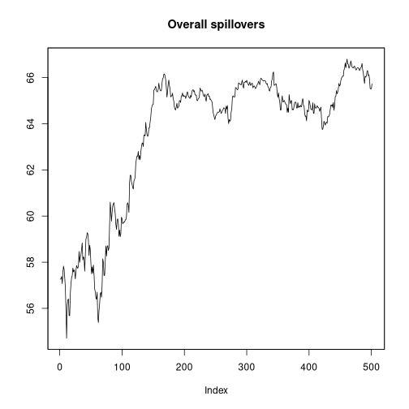
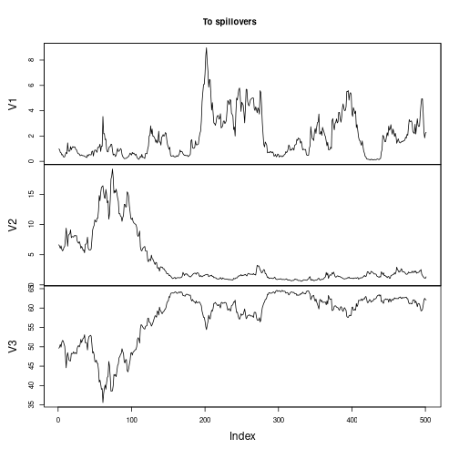
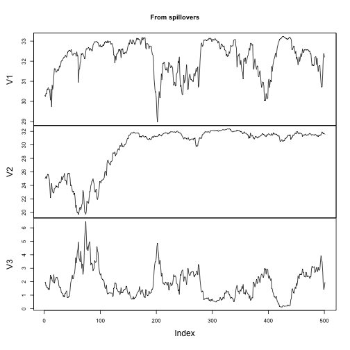
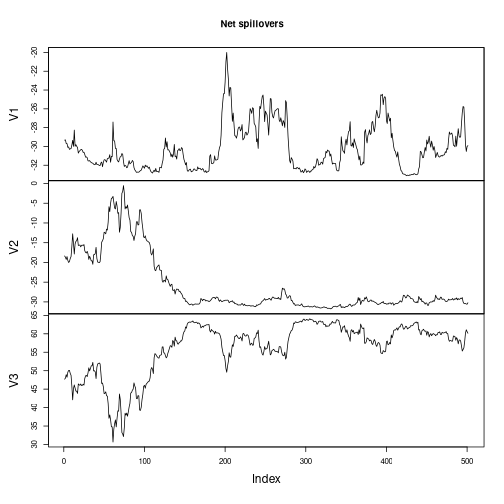
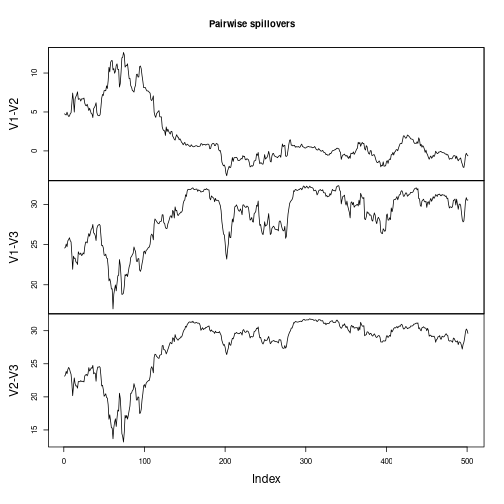
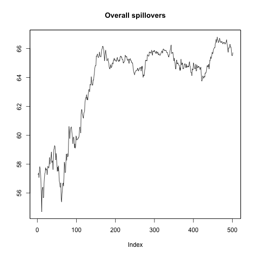

# frequencyConnectedness
[](https://travis-ci.org/tomaskrehlik/frequencyConnectedness.svg?branch=master)

A package implementing frequency dependent connectedness due to [Barunik, Krehlik (2015)][BK2015] as well as the traditional definitions of [Diebold, Yilmaz (2009, 2012)][DY09]. See the papers for detailed description.

## NOTICE

There is a new version of the interface coming with the version `0.2.0`. If you implemented anything prior to this version, you can install the older stable version using


```r
# install.packages("devtools")
library(devtools)
install_github("tomaskrehlik/frequencyConnectedness", tag = "0.1.6") 
```

## Installation

The stable version can be installed from `CRAN` by the standard means of using `install.packages("frequencyConnectedness")`. If there is any other development version, you can install it using the following instructions.

Be sure to have installed the `devtools` package that allows you to install packages from Github directly. To install the version from branch `dev` do


```r
# install.packages("devtools")
library(devtools)
install_github("tomaskrehlik/frequencyConnectedness", tag = "dev") 
```

## Usage

Currently the package works in close cooperation with the `vars`, `urca`, and `BigVAR` packages. In general, if you have any model that can produce the forecast error variance decomposition, it can be relatively easily made to work with this package. Let me know by filing an issue, if that is the case and I will try to incorporate it. 

For the time being the following is available:

- Traditional estimation of VAR
- Fitting of the VECM model
- Using `BigVAR` to fit VAR models with various penalization schemes

For the illustration purposes we include some simulated data and volatilities data from the [Ox-Man institute](http://realized.oxford-man.ox.ac.uk/).

Let's walk through some basics. First load packages and get some data.


```r
library(frequencyConnectedness)
data(exampleSim)
# Shorten the data, rolling estimation takes quite some time
exampleSim <- exampleSim[1:600,]
```

Then compute a system estimate on which the computation of connectedness is based:


```r
# Compute the VAR(2) estimate with constant and save results
est <- VAR(exampleSim, p = 2, type = "const")
# Alternatively, you could use VECM
# est <- vec2var(ca.jo(exampleSim, ecdet = "trend", K = 2), r = 1)
```

Then use the estimate to compute the connectedness measures.
First, the traditional overall measures that are not frequency dependent as in Diebold and Yilmaz, also with the possibility of nullifying the cross correlation elements. These commands print out the table and all the relevant measures.


```r
# Compute traditional spillovers
spilloverDY09(est, n.ahead = 100, no.corr = F)
```

```
## The spillover table has no frequency bands, standard Diebold & Yilmaz.
## 
## 
## |   |   V1|    V2|    V3|  FROM|
## |:--|----:|-----:|-----:|-----:|
## |V1 | 8.84|  7.13| 84.03| 30.39|
## |V2 | 2.65| 10.09| 87.26| 29.97|
## |V3 | 0.31|  0.20| 99.50|  0.17|
## |TO | 0.99|  2.44| 57.10| 60.53|
```

```r
spilloverDY12(est, n.ahead = 100, no.corr = F)
```

```
## The spillover table has no frequency bands, standard Diebold & Yilmaz.
## 
## 
## |   |   V1|    V2|    V3|  FROM|
## |:--|----:|-----:|-----:|-----:|
## |V1 | 8.56| 10.34| 81.09| 30.48|
## |V2 | 2.62| 11.50| 85.88| 29.50|
## |V3 | 0.31|  0.26| 99.43|  0.19|
## |TO | 0.97|  3.53| 55.66| 60.17|
```

```r
spilloverDY09(est, n.ahead = 100, no.corr = T)
```

```
## The spillover table has no frequency bands, standard Diebold & Yilmaz.
## 
## 
## |   |   V1|    V2|    V3|  FROM|
## |:--|----:|-----:|-----:|-----:|
## |V1 | 5.61|  8.15| 86.24| 31.46|
## |V2 | 1.10| 11.09| 87.81| 29.64|
## |V3 | 0.24|  0.22| 99.54|  0.15|
## |TO | 0.44|  2.79| 58.02| 61.25|
```

```r
spilloverDY12(est, n.ahead = 100, no.corr = T)
```

```
## The spillover table has no frequency bands, standard Diebold & Yilmaz.
## 
## 
## |   |   V1|    V2|    V3|  FROM|
## |:--|----:|-----:|-----:|-----:|
## |V1 | 5.61|  8.15| 86.24| 31.46|
## |V2 | 1.10| 11.09| 87.81| 29.64|
## |V3 | 0.24|  0.22| 99.54|  0.15|
## |TO | 0.44|  2.79| 58.02| 61.25|
```

If you save them, you can use the functions `overall, to, from, net, pairwise` to extract the spillovers in numeric form


```r
sp <- spilloverDY12(est, n.ahead = 100, no.corr = T)
overall(sp)
```

```
## [[1]]
## [1] 61.25391
```

```r
to(sp)
```

```
## [[1]]
##         V1         V2         V3 
##  0.4445176  2.7906399 58.0187552
```

```r
from(sp)
```

```
## [[1]]
##         V1         V2         V3 
## 31.4636556 29.6365456  0.1537115
```

```r
net(sp)
```

```
## [[1]]
##        V1        V2        V3 
## -31.01914 -26.84591  57.86504
```

```r
pairwise(sp)
```

```
## [[1]]
##     V1-V2     V1-V3     V2-V3 
##  2.350667 28.668472 29.196572
```

Next, we can decompose the measure on desired frequencies and get the frequency dependent measures.


```r
# Get the frequency connectedness on partition (pi,pi/4), (pi/4,0), roughly
# corresponding to movements of 1 to 4 days and 4 to longer.
bounds <- c(pi+0.00001, pi/4, 0)
spilloverBK09(est, n.ahead = 100, no.corr = F, partition = bounds)
```

```
## The spillover table has 2 frequency bands.
## 
## 
## The spillover table for band: 3.14 to 0.79
## Roughly corresponds to 1 days to 4 days.
## 
## 
## |       |   V1|   V2|    V3| FROM_ABS| FROM_WTH|
## |:------|----:|----:|-----:|--------:|--------:|
## |V1     | 0.15| 0.26|  0.55|     0.27|     2.11|
## |V2     | 0.09| 2.27|  4.85|     1.65|    12.97|
## |V3     | 0.04| 0.02| 29.87|     0.02|     0.17|
## |TO_ABS | 0.04| 0.09|  1.80|     1.94|         |
## |TO_WTH | 0.35| 0.73| 14.17|         |    15.25|
## 
## 
## The spillover table for band: 0.79 to 0.00
## Roughly corresponds to 4 days to Inf days.
## 
## 
## |       |   V1|   V2|    V3| FROM_ABS| FROM_WTH|
## |:------|----:|----:|-----:|--------:|--------:|
## |V1     | 8.69| 6.87| 83.49|    30.12|    34.50|
## |V2     | 2.56| 7.82| 82.41|    28.32|    32.44|
## |V3     | 0.27| 0.17| 69.62|     0.15|     0.17|
## |TO_ABS | 0.94| 2.35| 55.30|    58.59|         |
## |TO_WTH | 1.08| 2.69| 63.34|         |    67.11|
```

```r
spilloverBK12(est, n.ahead = 100, no.corr = F, partition = bounds)
```

```
## The spillover table has 2 frequency bands.
## 
## 
## The spillover table for band: 3.14 to 0.79
## Roughly corresponds to 1 days to 4 days.
## 
## 
## |       |   V1|   V2|    V3| FROM_ABS| FROM_WTH|
## |:------|----:|----:|-----:|--------:|--------:|
## |V1     | 0.14| 0.28|  0.53|     0.27|     2.11|
## |V2     | 0.09| 2.30|  4.81|     1.63|    12.87|
## |V3     | 0.04| 0.04| 29.86|     0.03|     0.21|
## |TO_ABS | 0.04| 0.10|  1.78|     1.93|         |
## |TO_WTH | 0.35| 0.82| 14.02|         |    15.19|
## 
## 
## The spillover table for band: 0.79 to 0.00
## Roughly corresponds to 4 days to Inf days.
## 
## 
## |       |   V1|    V2|    V3| FROM_ABS| FROM_WTH|
## |:------|----:|-----:|-----:|--------:|--------:|
## |V1     | 8.42| 10.07| 80.57|    30.21|    34.60|
## |V2     | 2.52|  9.20| 81.07|    27.86|    31.92|
## |V3     | 0.27|  0.22| 69.57|     0.16|     0.19|
## |TO_ABS | 0.93|  3.43| 53.88|    58.24|         |
## |TO_WTH | 1.07|  3.93| 61.71|         |    66.71|
```

```r
spilloverBK09(est, n.ahead = 100, no.corr = T, partition = bounds)
```

```
## The spillover table has 2 frequency bands.
## 
## 
## The spillover table for band: 3.14 to 0.79
## Roughly corresponds to 1 days to 4 days.
## 
## 
## |       |   V1|   V2|    V3| FROM_ABS| FROM_WTH|
## |:------|----:|----:|-----:|--------:|--------:|
## |V1     | 0.13| 0.28|  0.56|     0.28|     2.20|
## |V2     | 0.03| 2.39|  4.88|     1.64|    12.86|
## |V3     | 0.03| 0.02| 29.89|     0.02|     0.14|
## |TO_ABS | 0.02| 0.10|  1.81|     1.94|         |
## |TO_WTH | 0.17| 0.79| 14.24|         |    15.20|
## 
## 
## The spillover table for band: 0.79 to 0.00
## Roughly corresponds to 4 days to Inf days.
## 
## 
## |       |   V1|   V2|    V3| FROM_ABS| FROM_WTH|
## |:------|----:|----:|-----:|--------:|--------:|
## |V1     | 5.48| 7.87| 85.68|    31.18|    35.74|
## |V2     | 1.06| 8.70| 82.93|    28.00|    32.09|
## |V3     | 0.21| 0.20| 69.65|     0.14|     0.16|
## |TO_ABS | 0.42| 2.69| 56.20|    59.32|         |
## |TO_WTH | 0.49| 3.08| 64.41|         |    67.98|
```

```r
spilloverBK12(est, n.ahead = 100, no.corr = T, partition = bounds)
```

```
## The spillover table has 2 frequency bands.
## 
## 
## The spillover table for band: 3.14 to 0.79
## Roughly corresponds to 1 days to 4 days.
## 
## 
## |       |   V1|   V2|    V3| FROM_ABS| FROM_WTH|
## |:------|----:|----:|-----:|--------:|--------:|
## |V1     | 0.13| 0.28|  0.56|     0.28|     2.20|
## |V2     | 0.03| 2.39|  4.88|     1.64|    12.86|
## |V3     | 0.03| 0.02| 29.89|     0.02|     0.14|
## |TO_ABS | 0.02| 0.10|  1.81|     1.94|         |
## |TO_WTH | 0.17| 0.79| 14.24|         |    15.20|
## 
## 
## The spillover table for band: 0.79 to 0.00
## Roughly corresponds to 4 days to Inf days.
## 
## 
## |       |   V1|   V2|    V3| FROM_ABS| FROM_WTH|
## |:------|----:|----:|-----:|--------:|--------:|
## |V1     | 5.48| 7.87| 85.68|    31.18|    35.74|
## |V2     | 1.06| 8.70| 82.93|    28.00|    32.09|
## |V3     | 0.21| 0.20| 69.65|     0.14|     0.16|
## |TO_ABS | 0.42| 2.69| 56.20|    59.32|         |
## |TO_WTH | 0.49| 3.08| 64.41|         |    67.98|
```

Note that the bounds should cover the range `(1.001, 0)*pi`, because the overall variance of the system is computed over these frequencies. (So if you wanted to remove the trend from computations, you could use `(1.001, 0.01)*pi` and the computation will ignore the variance created around the zero frequency.) Again, if you save the outputs from the `spillover....` function, you can evaluate the `overall, to, from, net, pairwise` to get the relevant tables.

Moreover, if you want to aggregate the behaviour of some of the bands, you can do:


```r
# Get the frequency connectedness on partition (pi,pi/4), (pi/4,0), roughly
# corresponding to movements of 1 to 4 days and 4 to longer.
bounds <- c(pi+0.00001, pi/4, pi/10, 0)

spilloverBK12(est, n.ahead = 100, no.corr = F, partition = bounds)
```

```
## The spillover table has 3 frequency bands.
## 
## 
## The spillover table for band: 3.14 to 0.79
## Roughly corresponds to 1 days to 4 days.
## 
## 
## |       |   V1|   V2|    V3| FROM_ABS| FROM_WTH|
## |:------|----:|----:|-----:|--------:|--------:|
## |V1     | 0.14| 0.28|  0.53|     0.27|     2.11|
## |V2     | 0.09| 2.30|  4.81|     1.63|    12.87|
## |V3     | 0.04| 0.04| 29.86|     0.03|     0.21|
## |TO_ABS | 0.04| 0.10|  1.78|     1.93|         |
## |TO_WTH | 0.35| 0.82| 14.02|         |    15.19|
## 
## 
## The spillover table for band: 0.79 to 0.31
## Roughly corresponds to 4 days to 10 days.
## 
## 
## |       |   V1|   V2|    V3| FROM_ABS| FROM_WTH|
## |:------|----:|----:|-----:|--------:|--------:|
## |V1     | 1.74| 3.00| 19.54|     7.51|    22.61|
## |V2     | 0.94| 4.25| 31.71|    10.88|    32.75|
## |V3     | 0.18| 0.10| 38.24|     0.09|     0.29|
## |TO_ABS | 0.38| 1.03| 17.08|    18.49|         |
## |TO_WTH | 1.13| 3.11| 51.40|         |    55.64|
## 
## 
## The spillover table for band: 0.31 to 0.00
## Roughly corresponds to 10 days to Inf days.
## 
## 
## |       |   V1|   V2|    V3| FROM_ABS| FROM_WTH|
## |:------|----:|----:|-----:|--------:|--------:|
## |V1     | 6.68| 7.07| 61.02|    22.70|    41.98|
## |V2     | 1.58| 4.95| 49.36|    16.98|    31.41|
## |V3     | 0.08| 0.12| 31.34|     0.07|     0.13|
## |TO_ABS | 0.55| 2.40| 36.79|    39.75|         |
## |TO_WTH | 1.03| 4.43| 68.05|         |    73.51|
```

```r
collapseBounds(spilloverBK12(est, n.ahead = 100, no.corr = F, partition = bounds), 1:2)
```

```
## The spillover table has 2 frequency bands.
## 
## 
## The spillover table for band: 3.14 to 0.31
## Roughly corresponds to 1 days to 10 days.
## 
## 
## |       |   V1|   V2|    V3| FROM_ABS| FROM_WTH|
## |:------|----:|----:|-----:|--------:|--------:|
## |V1     | 1.88| 3.27| 20.07|     7.78|    16.94|
## |V2     | 1.04| 6.55| 36.52|    12.52|    27.25|
## |V3     | 0.22| 0.14| 68.10|     0.12|     0.26|
## |TO_ABS | 0.42| 1.14| 18.86|    20.42|         |
## |TO_WTH | 0.91| 2.48| 41.07|         |    44.46|
## 
## 
## The spillover table for band: 0.31 to 0.00
## Roughly corresponds to 10 days to Inf days.
## 
## 
## |       |   V1|   V2|    V3| FROM_ABS| FROM_WTH|
## |:------|----:|----:|-----:|--------:|--------:|
## |V1     | 6.68| 7.07| 61.02|    22.70|    41.98|
## |V2     | 1.58| 4.95| 49.36|    16.98|    31.41|
## |V3     | 0.08| 0.12| 31.34|     0.07|     0.13|
## |TO_ABS | 0.55| 2.40| 36.79|    39.75|         |
## |TO_WTH | 1.03| 4.43| 68.05|         |    73.51|
```


In many cases, one is interested in the dynamics of the connectedness. This can be achieved within the package by the following commands.


```r
# Get the rolling window estimates
params_est = list(p = 2, type = "const")
sp <- spilloverRollingDY09(exampleSim, n.ahead = 100, no.corr = F, "VAR", params_est = params_est, window = 100)
# alternatively for co-integration you could do
# coint_est <- function(data, r) {
#     return(vec2var(ca.jo(data, ecdet = "trend", K = 2), r = r))
# }
# params_est = list(r = 1)
# sp <- spilloverRollingDY09(exampleSim, n.ahead = 100, no.corr = F, "coint_est", params_est = params_est, window = 100)
```

In general, the `spilloverRolling....` function takes the following arguments:

- data, as `exampleSim`
- the arguments for relevant spillover function, as `n.ahead, no.corr`, and alternatively `partition` in case of the `BK` variant.
- window, what window you should roll
- name of function used for estimates, in this case `"VAR"`, and list of parameters for this function called `params_est`

Using this, one can plot the resulting spillover measures.


```r
plotOverall(sp)
```



```r
plotTo(sp)
```



```r
plotFrom(sp)
```



```r
plotNet(sp)
```



```r
plotPairwise(sp)
```



It is generally not a good idea to print all the spillover tables as they are not informative.

To make your own rolling estimate, let's follow this example. First, we start with construction of unconditional estimate and then use the same function for the rolling estimate. We perform VAR-LASSO estimation on a big system of log-volatilities of financial indices with automatic selection of the LASSO penalty using cross-validation.


```r
# Example of usage of BigVAR package on the volatilities data that are included
data(volatilities)

big_var_est <- function(data) {
    Model1 = constructModel(as.matrix(data), p = 4, struct = "Basic", gran = c(50, 50), VARX = list(), verbose = F)
    Model1Results = cv.BigVAR(Model1)
}

# Perform the estimation
oo <- big_var_est(log(volatilities[apply(volatilities>0, 1, all),]))

spilloverDY12(oo, n.ahead = 100, no.corr = F)
```

```
## The spillover table has no frequency bands, standard Diebold & Yilmaz.
## 
## 
## |                        | S.P.500| FTSE.100| Nikkei.225|   DAX| Russel.2000| All.Ordinaries|  DJIA| Nasdaq.100| CAC.40| Hang.Seng| KOSPI.Composite.Index| AEX.Index| Swiss.Market.Index| IBEX.35| S.P.CNX.Nifty| IPC.Mexico| Bovespa.Index| S.P.TSX.Composite.Index| Euro.STOXX.50| FT.Straits.Times.Index| FTSE.MIB|  FROM|
## |:-----------------------|-------:|--------:|----------:|-----:|-----------:|--------------:|-----:|----------:|------:|---------:|---------------------:|---------:|------------------:|-------:|-------------:|----------:|-------------:|-----------------------:|-------------:|----------------------:|--------:|-----:|
## |S.P.500                 |   12.83|     6.32|       0.28|  5.00|       10.03|           0.88| 11.73|      11.38|   5.06|      0.22|                  0.77|      5.49|               4.26|    4.02|          0.04|       3.06|          2.43|                    7.12|          5.10|                   0.16|     3.81|  4.15|
## |FTSE.100                |    7.05|    10.38|       0.21|  7.64|        5.68|           1.35|  6.73|       6.22|   7.99|      0.22|                  0.76|      8.63|               6.26|    6.44|          0.27|       2.30|          1.79|                    5.90|          7.97|                   0.13|     6.06|  4.27|
## |Nikkei.225              |    5.87|     3.03|      40.48|  3.12|        3.23|           3.32|  6.04|       5.00|   2.71|      2.43|                  1.90|      2.92|               3.25|    2.77|          0.29|       3.39|          1.76|                    2.97|          3.09|                   0.78|     1.66|  2.83|
## |DAX                     |    5.67|     8.44|       0.25| 11.23|        4.41|           0.95|  5.50|       5.01|   9.24|      0.32|                  0.64|      9.36|               6.31|    7.28|          0.15|       1.68|          1.76|                    4.82|          9.66|                   0.19|     7.14|  4.23|
## |Russel.2000             |   12.14|     5.65|       0.14|  4.40|       16.17|           0.58| 10.84|      12.36|   4.38|      0.14|                  0.62|      4.90|               3.94|    3.54|          0.07|       3.04|          2.22|                    6.96|          4.38|                   0.11|     3.40|  3.99|
## |All.Ordinaries          |    6.66|     5.94|       1.85|  5.35|        4.66|          20.01|  6.65|       5.73|   4.91|      1.89|                  1.23|      5.51|               4.91|    4.24|          0.22|       2.24|          1.80|                    7.05|          5.20|                   0.71|     3.24|  3.81|
## |DJIA                    |   12.36|     6.45|       0.35|  5.14|        9.28|           1.17| 12.53|      10.71|   5.16|      0.27|                  0.74|      5.62|               4.40|    4.13|          0.04|       3.06|          2.49|                    6.92|          5.21|                   0.21|     3.75|  4.17|
## |Nasdaq.100              |   12.58|     5.65|       0.21|  4.59|       11.40|           0.66| 11.24|      14.50|   4.59|      0.18|                  0.51|      5.09|               3.75|    3.60|          0.04|       3.14|          2.66|                    7.28|          4.60|                   0.19|     3.55|  4.07|
## |CAC.40                  |    5.79|     8.69|       0.20|  8.90|        4.36|           1.01|  5.57|       5.06|  10.11|      0.19|                  0.57|      9.71|               6.41|    7.75|          0.16|       1.72|          1.54|                    4.66|          9.71|                   0.12|     7.81|  4.28|
## |Hang.Seng               |    4.62|     3.27|       2.78|  3.79|        2.83|           4.12|  4.71|       3.79|   2.85|     40.53|                  2.61|      3.39|               2.90|    2.41|          0.60|       1.25|          1.69|                    4.60|          3.32|                   2.34|     1.60|  2.83|
## |KOSPI.Composite.Index   |    7.26|     5.35|       0.92|  4.54|        6.91|           1.22|  6.87|       6.40|   4.20|      1.16|                 26.59|      4.58|               4.39|    3.46|          0.65|       2.16|          1.07|                    4.36|          4.27|                   0.44|     3.18|  3.50|
## |AEX.Index               |    6.20|     8.71|       0.21|  8.57|        4.84|           1.27|  5.99|       5.59|   9.01|      0.31|                  0.60|     10.15|               6.32|    7.01|          0.17|       2.01|          1.78|                    5.54|          8.85|                   0.17|     6.68|  4.28|
## |Swiss.Market.Index      |    6.56|     8.44|       0.50|  7.56|        4.95|           1.78|  6.37|       5.75|   7.91|      0.32|                  0.84|      8.31|              11.88|    6.53|          0.28|       2.18|          1.53|                    4.56|          7.80|                   0.22|     5.74|  4.20|
## |IBEX.35                 |    5.03|     8.40|       0.29|  8.56|        4.01|           0.46|  4.86|       4.34|   9.65|      0.08|                  0.49|      9.25|               6.45|   12.03|          0.20|       1.76|          1.65|                    3.07|         10.14|                   0.05|     9.23|  4.19|
## |S.P.CNX.Nifty           |    2.32|     4.04|       0.49|  2.98|        2.87|           0.85|  2.05|       2.12|   2.60|      1.54|                  1.41|      2.94|               3.29|    2.39|         57.49|       2.29|          1.42|                    1.91|          2.72|                   0.48|     1.81|  2.02|
## |IPC.Mexico              |    7.98|     5.38|       1.24|  4.33|        6.18|           0.88|  7.61|       7.11|   4.31|      0.18|                  0.79|      4.94|               3.94|    3.75|          0.48|      23.13|          5.04|                    5.28|          4.13|                   0.27|     3.07|  3.66|
## |Bovespa.Index           |    7.25|     4.85|       0.87|  4.43|        4.75|           0.36|  7.00|       6.51|   4.37|      0.38|                  0.41|      4.56|               2.91|    3.86|          0.26|       5.09|         27.94|                    6.13|          4.57|                   0.20|     3.29|  3.43|
## |S.P.TSX.Composite.Index |    9.90|     5.92|       0.15|  4.86|        8.26|           1.50|  9.21|       9.27|   4.70|      0.30|                  0.54|      5.48|               3.47|    3.55|          0.09|       2.92|          3.10|                   18.17|          4.69|                   0.19|     3.73|  3.90|
## |Euro.STOXX.50           |    5.68|     8.61|       0.24|  9.18|        4.34|           1.02|  5.47|       4.94|   9.64|      0.21|                  0.57|      9.47|               6.30|    8.01|          0.15|       1.63|          1.54|                    4.57|         10.14|                   0.13|     8.15|  4.28|
## |FT.Straits.Times.Index  |    4.37|     3.63|       2.35|  4.33|        2.72|           3.89|  4.55|       4.01|   3.37|      3.81|                  1.28|      3.86|               3.21|    2.57|          0.52|       2.16|          1.68|                    4.43|          3.65|                  37.47|     2.15|  2.98|
## |FTSE.MIB                |    5.05|     8.36|       0.21|  8.54|        3.86|           0.33|  4.77|       4.55|   9.61|      0.04|                  0.42|      9.33|               6.01|    8.97|          0.15|       1.42|          1.50|                    3.83|          9.99|                   0.06|    13.00|  4.14|
## |TO                      |    6.68|     5.96|       0.65|  5.51|        5.22|           1.31|  6.37|       5.99|   5.54|      0.68|                  0.84|      5.87|               4.41|    4.59|          0.23|       2.31|          1.93|                    4.86|          5.67|                   0.34|     4.24| 79.20|
```

```r
spilloverBK12(oo, n.ahead = 100, no.corr = F, partition = bounds)
```

```
## The spillover table has 3 frequency bands.
## 
## 
## The spillover table for band: 3.14 to 0.79
## Roughly corresponds to 1 days to 4 days.
## 
## 
## |                        | S.P.500| FTSE.100| Nikkei.225|  DAX| Russel.2000| All.Ordinaries| DJIA| Nasdaq.100| CAC.40| Hang.Seng| KOSPI.Composite.Index| AEX.Index| Swiss.Market.Index| IBEX.35| S.P.CNX.Nifty| IPC.Mexico| Bovespa.Index| S.P.TSX.Composite.Index| Euro.STOXX.50| FT.Straits.Times.Index| FTSE.MIB| FROM_ABS| FROM_WTH|
## |:-----------------------|-------:|--------:|----------:|----:|-----------:|--------------:|----:|----------:|------:|---------:|---------------------:|---------:|------------------:|-------:|-------------:|----------:|-------------:|-----------------------:|-------------:|----------------------:|--------:|--------:|--------:|
## |S.P.500                 |    3.02|     1.12|       0.06| 0.89|        2.05|           0.06| 2.75|       2.43|   0.90|      0.04|                  0.11|      0.96|               0.65|    0.72|          0.01|       0.70|          0.71|                    1.44|          0.92|                   0.03|     0.70|     0.82|     4.11|
## |FTSE.100                |    0.84|     2.46|       0.03| 1.61|        0.55|           0.08| 0.82|       0.68|   1.76|      0.01|                  0.08|      1.82|               1.32|    1.43|          0.06|       0.32|          0.31|                    0.49|          1.74|                   0.01|     1.35|     0.73|     3.64|
## |Nikkei.225              |    0.52|     0.26|      10.80| 0.29|        0.41|           0.55| 0.52|       0.47|   0.24|      0.55|                  0.32|      0.26|               0.31|    0.27|          0.06|       0.25|          0.16|                    0.34|          0.29|                   0.13|     0.17|     0.30|     1.51|
## |DAX                     |    0.75|     1.77|       0.06| 2.72|        0.48|           0.06| 0.75|       0.63|   2.14|      0.03|                  0.11|      2.08|               1.38|    1.70|          0.04|       0.26|          0.31|                    0.43|          2.25|                   0.03|     1.60|     0.80|     4.01|
## |Russel.2000             |    2.69|     0.98|       0.04| 0.74|        3.92|           0.07| 2.38|       2.73|   0.72|      0.03|                  0.06|      0.82|               0.58|    0.60|          0.01|       0.72|          0.70|                    1.47|          0.73|                   0.02|     0.56|     0.79|     3.96|
## |All.Ordinaries          |    0.30|     0.27|       0.34| 0.22|        0.23|           7.04| 0.30|       0.25|   0.20|      0.21|                  0.13|      0.23|               0.29|    0.21|          0.03|       0.11|          0.09|                    0.26|          0.22|                   0.11|     0.12|     0.20|     0.98|
## |DJIA                    |    2.86|     1.14|       0.07| 0.93|        1.89|           0.06| 3.19|       2.23|   0.93|      0.04|                  0.12|      0.99|               0.66|    0.76|          0.01|       0.69|          0.70|                    1.39|          0.95|                   0.04|     0.71|     0.82|     4.09|
## |Nasdaq.100              |    3.08|     1.17|       0.04| 0.95|        2.63|           0.06| 2.72|       3.79|   0.95|      0.03|                  0.09|      1.06|               0.69|    0.74|          0.01|       0.76|          0.79|                    1.70|          0.95|                   0.04|     0.75|     0.92|     4.58|
## |CAC.40                  |    0.68|     1.74|       0.04| 1.93|        0.41|           0.05| 0.68|       0.56|   2.50|      0.01|                  0.07|      2.14|               1.35|    1.77|          0.03|       0.24|          0.27|                    0.38|          2.27|                   0.01|     1.65|     0.78|     3.88|
## |Hang.Seng               |    0.23|     0.10|       0.85| 0.16|        0.17|           0.45| 0.24|       0.19|   0.09|     17.60|                  0.57|      0.12|               0.13|    0.09|          0.16|       0.06|          0.13|                    0.15|          0.13|                   0.78|     0.07|     0.23|     1.16|
## |KOSPI.Composite.Index   |    0.41|     0.37|       0.36| 0.39|        0.28|           0.20| 0.42|       0.30|   0.31|      0.39|                 10.65|      0.32|               0.39|    0.28|          0.10|       0.20|          0.13|                    0.21|          0.33|                   0.12|     0.23|     0.27|     1.36|
## |AEX.Index               |    0.65|     1.65|       0.04| 1.71|        0.42|           0.05| 0.65|       0.56|   1.95|      0.01|                  0.07|      2.23|               1.25|    1.50|          0.03|       0.26|          0.25|                    0.41|          1.87|                   0.02|     1.44|     0.70|     3.52|
## |Swiss.Market.Index      |    0.51|     1.38|       0.07| 1.31|        0.35|           0.11| 0.51|       0.42|   1.42|      0.02|                  0.11|      1.45|               2.63|    1.20|          0.06|       0.24|          0.19|                    0.27|          1.38|                   0.02|     1.05|     0.57|     2.87|
## |IBEX.35                 |    0.70|     1.78|       0.07| 1.92|        0.44|           0.09| 0.70|       0.56|   2.21|      0.02|                  0.09|      2.05|               1.42|    3.13|          0.05|       0.27|          0.29|                    0.37|          2.35|                   0.01|     2.00|     0.83|     4.14|
## |S.P.CNX.Nifty           |    0.45|     0.61|       0.11| 0.45|        0.46|           0.08| 0.41|       0.46|   0.43|      0.18|                  0.18|      0.46|               0.50|    0.42|         20.08|       0.32|          0.22|                    0.27|          0.45|                   0.09|     0.35|     0.33|     1.64|
## |IPC.Mexico              |    1.84|     1.13|       0.17| 0.79|        1.44|           0.10| 1.75|       1.58|   0.83|      0.00|                  0.17|      1.00|               0.78|    0.73|          0.11|       8.82|          1.19|                    1.18|          0.74|                   0.05|     0.57|     0.77|     3.84|
## |Bovespa.Index           |    1.57|     0.93|       0.05| 0.81|        1.21|           0.02| 1.50|       1.40|   0.79|      0.06|                  0.07|      0.83|               0.53|    0.68|          0.05|       1.00|          7.34|                    1.11|          0.83|                   0.03|     0.55|     0.67|     3.34|
## |S.P.TSX.Composite.Index |    1.96|     0.93|       0.04| 0.74|        1.52|           0.05| 1.81|       1.84|   0.73|      0.02|                  0.08|      0.87|               0.49|    0.54|          0.01|       0.61|          0.68|                    4.24|          0.72|                   0.02|     0.61|     0.68|     3.40|
## |Euro.STOXX.50           |    0.72|     1.75|       0.06| 2.06|        0.44|           0.06| 0.72|       0.59|   2.29|      0.02|                  0.08|      2.07|               1.32|    1.91|          0.04|       0.22|          0.29|                    0.39|          2.52|                   0.01|     1.76|     0.80|     4.00|
## |FT.Straits.Times.Index  |    0.24|     0.16|       0.21| 0.26|        0.19|           0.29| 0.29|       0.28|   0.17|      0.83|                  0.19|      0.21|               0.17|    0.14|          0.09|       0.16|          0.10|                    0.18|          0.19|                  23.50|     0.13|     0.21|     1.06|
## |FTSE.MIB                |    0.74|     1.85|       0.04| 2.00|        0.45|           0.03| 0.72|       0.62|   2.30|      0.00|                  0.08|      2.16|               1.37|    2.24|          0.04|       0.23|          0.26|                    0.45|          2.42|                   0.01|     3.43|     0.86|     4.28|
## |TO_ABS                  |    1.04|     1.00|       0.13| 0.96|        0.76|           0.12| 0.98|       0.89|   1.02|      0.12|                  0.13|      1.04|               0.74|    0.85|          0.05|       0.36|          0.37|                    0.61|          1.04|                   0.08|     0.78|    13.08|         |
## |TO_WTH                  |    5.17|     5.02|       0.65| 4.79|        3.81|           0.59| 4.91|       4.47|   5.09|      0.59|                  0.67|      5.21|               3.71|    4.27|          0.24|       1.81|          1.85|                    3.07|          5.17|                   0.38|     3.89|         |    65.35|
## 
## 
## The spillover table for band: 0.79 to 0.31
## Roughly corresponds to 4 days to 10 days.
## 
## 
## |                        | S.P.500| FTSE.100| Nikkei.225|  DAX| Russel.2000| All.Ordinaries| DJIA| Nasdaq.100| CAC.40| Hang.Seng| KOSPI.Composite.Index| AEX.Index| Swiss.Market.Index| IBEX.35| S.P.CNX.Nifty| IPC.Mexico| Bovespa.Index| S.P.TSX.Composite.Index| Euro.STOXX.50| FT.Straits.Times.Index| FTSE.MIB| FROM_ABS| FROM_WTH|
## |:-----------------------|-------:|--------:|----------:|----:|-----------:|--------------:|----:|----------:|------:|---------:|---------------------:|---------:|------------------:|-------:|-------------:|----------:|-------------:|-----------------------:|-------------:|----------------------:|--------:|--------:|--------:|
## |S.P.500                 |    2.24|     0.88|       0.06| 0.70|        1.65|           0.08| 2.03|       1.97|   0.72|      0.03|                  0.09|      0.77|               0.57|    0.58|          0.01|       0.53|          0.49|                    1.06|          0.73|                   0.02|     0.56|     0.64|     4.28|
## |FTSE.100                |    0.83|     1.38|       0.05| 0.97|        0.66|           0.11| 0.79|       0.72|   1.04|      0.01|                  0.08|      1.12|               0.79|    0.85|          0.04|       0.30|          0.26|                    0.56|          1.04|                   0.01|     0.80|     0.52|     3.48|
## |Nikkei.225              |    1.28|     0.62|       7.06| 0.65|        0.86|           0.50| 1.30|       1.11|   0.58|      0.44|                  0.36|      0.62|               0.64|    0.59|          0.07|       0.60|          0.36|                    0.72|          0.66|                   0.14|     0.41|     0.60|     3.95|
## |DAX                     |    0.81|     1.26|       0.07| 1.75|        0.64|           0.08| 0.78|       0.71|   1.42|      0.03|                  0.09|      1.42|               0.96|    1.15|          0.03|       0.26|          0.28|                    0.51|          1.50|                   0.03|     1.09|     0.63|     4.15|
## |Russel.2000             |    2.03|     0.77|       0.04| 0.60|        2.87|           0.05| 1.80|       2.11|   0.59|      0.02|                  0.07|      0.66|               0.51|    0.49|          0.01|       0.54|          0.46|                    1.09|          0.60|                   0.02|     0.46|     0.62|     4.09|
## |All.Ordinaries          |    0.76|     0.59|       0.35| 0.51|        0.59|           3.45| 0.77|       0.65|   0.48|      0.27|                  0.16|      0.54|               0.54|    0.45|          0.04|       0.27|          0.20|                    0.60|          0.52|                   0.10|     0.30|     0.41|     2.74|
## |DJIA                    |    2.16|     0.91|       0.07| 0.73|        1.52|           0.12| 2.20|       1.84|   0.74|      0.03|                  0.09|      0.79|               0.60|    0.61|          0.01|       0.52|          0.49|                    1.02|          0.76|                   0.03|     0.57|     0.65|     4.30|
## |Nasdaq.100              |    2.34|     0.90|       0.05| 0.73|        2.12|           0.07| 2.07|       2.83|   0.73|      0.03|                  0.07|      0.81|               0.56|    0.57|          0.01|       0.60|          0.57|                    1.27|          0.73|                   0.04|     0.57|     0.71|     4.69|
## |CAC.40                  |    0.77|     1.23|       0.05| 1.27|        0.55|           0.10| 0.75|       0.67|   1.53|      0.02|                  0.07|      1.44|               0.92|    1.18|          0.03|       0.25|          0.23|                    0.47|          1.46|                   0.01|     1.18|     0.60|     4.00|
## |Hang.Seng               |    0.56|     0.28|       0.49| 0.36|        0.38|           0.43| 0.57|       0.46|   0.26|      7.50|                  0.42|      0.31|               0.29|    0.25|          0.10|       0.13|          0.22|                    0.35|          0.33|                   0.40|     0.15|     0.32|     2.13|
## |KOSPI.Composite.Index   |    0.85|     0.58|       0.25| 0.53|        0.69|           0.14| 0.83|       0.71|   0.47|      0.22|                  5.13|      0.50|               0.49|    0.41|          0.09|       0.33|          0.26|                    0.44|          0.49|                   0.08|     0.36|     0.41|     2.75|
## |AEX.Index               |    0.77|     1.21|       0.05| 1.20|        0.61|           0.10| 0.75|       0.70|   1.34|      0.03|                  0.07|      1.53|               0.90|    1.04|          0.03|       0.27|          0.25|                    0.54|          1.29|                   0.02|     0.98|     0.58|     3.84|
## |Swiss.Market.Index      |    0.69|     1.09|       0.07| 1.01|        0.49|           0.16| 0.68|       0.59|   1.08|      0.03|                  0.09|      1.11|               1.81|    0.91|          0.05|       0.26|          0.21|                    0.39|          1.06|                   0.02|     0.80|     0.51|     3.41|
## |IBEX.35                 |    0.83|     1.41|       0.08| 1.46|        0.61|           0.09| 0.81|       0.70|   1.65|      0.02|                  0.08|      1.57|               1.09|    2.14|          0.04|       0.30|          0.30|                    0.45|          1.74|                   0.01|     1.54|     0.70|     4.67|
## |S.P.CNX.Nifty           |    0.53|     0.91|       0.11| 0.68|        0.60|           0.10| 0.46|       0.52|   0.65|      0.15|                  0.19|      0.70|               0.72|    0.62|          9.74|       0.48|          0.33|                    0.35|          0.68|                   0.08|     0.55|     0.45|     2.97|
## |IPC.Mexico              |    1.30|     0.81|       0.17| 0.62|        1.06|           0.09| 1.23|       1.19|   0.63|      0.01|                  0.12|      0.73|               0.58|    0.55|          0.08|       4.37|          0.73|                    0.79|          0.59|                   0.04|     0.45|     0.56|     3.72|
## |Bovespa.Index           |    1.36|     0.73|       0.07| 0.62|        1.14|           0.03| 1.27|       1.27|   0.61|      0.04|                  0.07|      0.65|               0.43|    0.52|          0.03|       0.76|          4.07|                    0.96|          0.63|                   0.03|     0.43|     0.55|     3.68|
## |S.P.TSX.Composite.Index |    1.24|     0.53|       0.03| 0.41|        1.08|           0.09| 1.14|       1.19|   0.40|      0.02|                  0.05|      0.48|               0.30|    0.31|          0.01|       0.38|          0.40|                    2.22|          0.40|                   0.02|     0.33|     0.42|     2.79|
## |Euro.STOXX.50           |    0.78|     1.27|       0.07| 1.38|        0.57|           0.11| 0.76|       0.66|   1.50|      0.02|                  0.07|      1.45|               0.95|    1.27|          0.03|       0.24|          0.24|                    0.48|          1.58|                   0.02|     1.29|     0.63|     4.16|
## |FT.Straits.Times.Index  |    0.47|     0.39|       0.38| 0.51|        0.31|           0.47| 0.50|       0.45|   0.39|      0.65|                  0.18|      0.44|               0.38|    0.31|          0.10|       0.28|          0.18|                    0.36|          0.43|                   7.42|     0.26|     0.36|     2.36|
## |FTSE.MIB                |    0.71|     1.27|       0.05| 1.32|        0.49|           0.05| 0.68|       0.63|   1.50|      0.01|                  0.07|      1.44|               0.93|    1.44|          0.03|       0.22|          0.23|                    0.46|          1.58|                   0.01|     2.13|     0.62|     4.14|
## |TO_ABS                  |    1.00|     0.84|       0.12| 0.77|        0.79|           0.14| 0.95|       0.90|   0.80|      0.10|                  0.12|      0.84|               0.63|    0.67|          0.04|       0.36|          0.32|                    0.61|          0.82|                   0.05|     0.62|    11.49|         |
## |TO_WTH                  |    6.66|     5.57|       0.81| 5.14|        5.25|           0.94| 6.31|       5.96|   5.30|      0.66|                  0.78|      5.55|               4.15|    4.46|          0.26|       2.38|          2.12|                    4.06|          5.43|                   0.35|     4.14|         |    76.30|
## 
## 
## The spillover table for band: 0.31 to 0.00
## Roughly corresponds to 10 days to Inf days.
## 
## 
## |                        | S.P.500| FTSE.100| Nikkei.225|  DAX| Russel.2000| All.Ordinaries| DJIA| Nasdaq.100| CAC.40| Hang.Seng| KOSPI.Composite.Index| AEX.Index| Swiss.Market.Index| IBEX.35| S.P.CNX.Nifty| IPC.Mexico| Bovespa.Index| S.P.TSX.Composite.Index| Euro.STOXX.50| FT.Straits.Times.Index| FTSE.MIB| FROM_ABS| FROM_WTH|
## |:-----------------------|-------:|--------:|----------:|----:|-----------:|--------------:|----:|----------:|------:|---------:|---------------------:|---------:|------------------:|-------:|-------------:|----------:|-------------:|-----------------------:|-------------:|----------------------:|--------:|--------:|--------:|
## |S.P.500                 |    7.57|     4.32|       0.15| 3.41|        6.33|           0.75| 6.95|       6.98|   3.44|      0.16|                  0.56|      3.77|               3.04|    2.72|          0.03|       1.84|          1.24|                    4.62|          3.45|                   0.11|     2.54|     2.69|     4.14|
## |FTSE.100                |    5.39|     6.54|       0.14| 5.06|        4.48|           1.17| 5.12|       4.82|   5.19|      0.20|                  0.60|      5.69|               4.15|    4.15|          0.17|       1.69|          1.21|                    4.85|          5.19|                   0.11|     3.92|     3.01|     4.64|
## |Nikkei.225              |    4.07|     2.15|      22.61| 2.18|        1.96|           2.28| 4.22|       3.42|   1.90|      1.43|                  1.22|      2.05|               2.30|    1.91|          0.17|       2.54|          1.24|                    1.90|          2.14|                   0.52|     1.09|     1.94|     2.98|
## |DAX                     |    4.11|     5.42|       0.12| 6.76|        3.29|           0.81| 3.96|       3.66|   5.68|      0.26|                  0.45|      5.85|               3.98|    4.43|          0.07|       1.16|          1.17|                    3.87|          5.91|                   0.14|     4.45|     2.80|     4.31|
## |Russel.2000             |    7.42|     3.91|       0.07| 3.06|        9.38|           0.46| 6.66|       7.53|   3.06|      0.09|                  0.49|      3.41|               2.85|    2.46|          0.05|       1.79|          1.06|                    4.40|          3.05|                   0.08|     2.38|     2.58|     3.98|
## |All.Ordinaries          |    5.61|     5.07|       1.16| 4.62|        3.84|           9.52| 5.58|       4.83|   4.23|      1.41|                  0.95|      4.74|               4.08|    3.58|          0.15|       1.86|          1.52|                    6.19|          4.46|                   0.49|     2.81|     3.20|     4.93|
## |DJIA                    |    7.35|     4.40|       0.21| 3.48|        5.87|           0.99| 7.15|       6.63|   3.49|      0.20|                  0.53|      3.83|               3.14|    2.77|          0.03|       1.85|          1.29|                    4.52|          3.50|                   0.13|     2.47|     2.70|     4.16|
## |Nasdaq.100              |    7.16|     3.57|       0.11| 2.90|        6.66|           0.53| 6.44|       7.88|   2.91|      0.12|                  0.35|      3.22|               2.50|    2.29|          0.02|       1.78|          1.30|                    4.31|          2.91|                   0.11|     2.23|     2.45|     3.77|
## |CAC.40                  |    4.33|     5.72|       0.10| 5.69|        3.40|           0.86| 4.15|       3.84|   6.08|      0.16|                  0.42|      6.13|               4.13|    4.80|          0.10|       1.23|          1.03|                    3.81|          5.99|                   0.10|     4.97|     2.90|     4.47|
## |Hang.Seng               |    3.83|     2.89|       1.44| 3.27|        2.27|           3.24| 3.89|       3.15|   2.51|     15.43|                  1.63|      2.96|               2.47|    2.07|          0.34|       1.07|          1.35|                    4.10|          2.86|                   1.16|     1.38|     2.28|     3.51|
## |KOSPI.Composite.Index   |    5.99|     4.40|       0.31| 3.62|        5.93|           0.88| 5.62|       5.40|   3.43|      0.55|                 10.82|      3.77|               3.51|    2.78|          0.46|       1.63|          0.67|                    3.71|          3.46|                   0.24|     2.59|     2.81|     4.33|
## |AEX.Index               |    4.78|     5.84|       0.13| 5.66|        3.81|           1.11| 4.59|       4.32|   5.72|      0.27|                  0.47|      6.39|               4.18|    4.47|          0.11|       1.47|          1.28|                    4.59|          5.69|                   0.14|     4.26|     3.00|     4.61|
## |Swiss.Market.Index      |    5.35|     5.97|       0.35| 5.24|        4.11|           1.52| 5.18|       4.75|   5.40|      0.27|                  0.63|      5.75|               7.44|    4.42|          0.17|       1.69|          1.13|                    3.91|          5.36|                   0.18|     3.90|     3.11|     4.79|
## |IBEX.35                 |    3.51|     5.21|       0.14| 5.19|        2.96|           0.29| 3.35|       3.08|   5.79|      0.05|                  0.32|      5.63|               3.94|    6.76|          0.12|       1.19|          1.05|                    2.25|          6.04|                   0.03|     5.68|     2.66|     4.09|
## |S.P.CNX.Nifty           |    1.34|     2.53|       0.27| 1.85|        1.81|           0.67| 1.18|       1.14|   1.52|      1.22|                  1.03|      1.77|               2.07|    1.35|         27.68|       1.49|          0.88|                    1.29|          1.60|                   0.32|     0.91|     1.25|     1.92|
## |IPC.Mexico              |    4.85|     3.44|       0.90| 2.92|        3.68|           0.68| 4.63|       4.34|   2.85|      0.16|                  0.50|      3.21|               2.58|    2.47|          0.29|       9.93|          3.11|                    3.31|          2.80|                   0.18|     2.05|     2.33|     3.59|
## |Bovespa.Index           |    4.33|     3.20|       0.76| 3.00|        2.40|           0.31| 4.22|       3.83|   2.96|      0.27|                  0.27|      3.09|               1.95|    2.66|          0.17|       3.33|         16.53|                    4.07|          3.11|                   0.15|     2.30|     2.21|     3.40|
## |S.P.TSX.Composite.Index |    6.69|     4.45|       0.08| 3.71|        5.67|           1.36| 6.25|       6.25|   3.57|      0.26|                  0.41|      4.13|               2.68|    2.70|          0.07|       1.94|          2.02|                   11.70|          3.57|                   0.15|     2.79|     2.80|     4.31|
## |Euro.STOXX.50           |    4.18|     5.60|       0.12| 5.74|        3.33|           0.85| 4.00|       3.68|   5.84|      0.17|                  0.41|      5.95|               4.03|    4.83|          0.09|       1.16|          1.01|                    3.70|          6.04|                   0.10|     5.10|     2.85|     4.39|
## |FT.Straits.Times.Index  |    3.66|     3.08|       1.76| 3.56|        2.22|           3.13| 3.77|       3.27|   2.81|      2.34|                  0.90|      3.21|               2.65|    2.12|          0.34|       1.71|          1.39|                    3.89|          3.03|                   6.54|     1.77|     2.41|     3.71|
## |FTSE.MIB                |    3.60|     5.25|       0.12| 5.22|        2.93|           0.26| 3.37|       3.31|   5.81|      0.03|                  0.27|      5.73|               3.71|    5.29|          0.09|       0.97|          1.00|                    2.92|          6.00|                   0.04|     7.44|     2.66|     4.10|
## |TO_ABS                  |    4.64|     4.11|       0.40| 3.78|        3.66|           1.05| 4.44|       4.20|   3.72|      0.46|                  0.59|      3.99|               3.04|    3.06|          0.14|       1.59|          1.24|                    3.63|          3.82|                   0.21|     2.84|    54.63|         |
## |TO_WTH                  |    7.15|     6.34|       0.62| 5.82|        5.64|           1.62| 6.83|       6.47|   5.73|      0.71|                  0.91|      6.15|               4.69|    4.71|          0.22|       2.45|          1.90|                    5.59|          5.88|                   0.33|     4.37|         |    84.14|
```

```r
# Now use the same function to perform the rolling estimation.
# The original estimation call was:
# big_var_est(log(volatilities[apply(volatilities>0, 1, all),]))
# so our data are:
# log(volatilities[apply(volatilities>0, 1, all),]) (we only use 1:150) because it takes a lot of time to fit
# n.ahead, no.corr, and window are self explanatory.
# name of the function to use for estimation is the big_var_est.
sp <- spilloverRollingBK09(log(volatilities[apply(volatilities>0, 1, all),])[1:150, ], n.ahead = 100, no.corr = F, "big_var_est", params_est = list(), window = 100)
```

```
## Error in get(func_est): argument "func_est" is missing, with no default
```

```r
plotOverall(sp)
```



```r
# I only plot 5 of the To indicators as plotting all of them is not nice
plotTo(sp, which = 1:5)
```

```
## Error in spills[[1]][, which]: subscript out of bounds
```

```r
# You can extract the to spillovers
head(to(sp))
```

```
## [[1]]
##               V1         V2       V3
##   [1,] 0.9735440  6.6468766 49.64159
##   [2,] 0.9364866  6.4386755 49.91411
##   [3,] 0.7111719  6.0641877 50.60683
##   [4,] 0.6800669  6.4745971 49.91629
##   [5,] 0.5085828  5.8965275 51.13273
##   [6,] 0.5418422  5.6373736 51.65106
##   [7,] 0.3795532  5.8131949 51.49785
##   [8,] 0.3369949  6.2400304 50.74973
##   [9,] 0.3737887  6.3889338 50.14209
##  [10,] 0.5560593  7.6857526 47.65664
##  [11,] 0.7056949  9.4107723 44.58897
##  [12,] 0.6134028  8.1392391 47.38695
##  [13,] 1.4615393  6.4151587 48.49507
##  [14,] 0.8293576  8.1835148 47.39311
##  [15,] 0.7934730  8.3839059 46.51095
##  [16,] 0.8155225  8.4693021 46.39840
##  [17,] 1.1678530  9.1344149 46.35151
##  [18,] 0.9193903  7.8334989 48.30634
##  [19,] 1.0755967  7.9970979 48.26625
##  [20,] 1.1672904  8.0069422 48.23643
##  [21,] 1.1023446  7.9280740 48.71793
##  [22,] 1.1492285  8.1595406 48.27142
##  [23,] 1.1278198  8.1951127 48.34396
##  [24,] 0.9532330  8.1266765 48.48055
##  [25,] 0.9163477  8.1790461 48.17714
##  [26,] 0.7535071  7.2837984 49.60817
##  [27,] 0.6257692  7.0329215 50.19941
##  [28,] 0.5934348  6.9040605 50.27108
##  [29,] 0.5799467  7.1760800 49.97963
##  [30,] 0.4501236  6.7417008 50.66249
##  [31,] 0.4693693  6.0671704 51.92830
##  [32,] 0.5132830  6.3821031 51.10043
##  [33,] 0.4575253  6.1283136 51.65216
##  [34,] 0.4470924  5.6972577 52.18581
##  [35,] 0.4441561  5.8009710 52.31235
##  [36,] 0.4099744  5.3150319 53.11382
##  [37,] 0.3669757  6.6818318 51.04848
##  [38,] 0.3495694  6.7593928 51.12102
##  [39,] 0.2970468  6.9741717 50.91539
##  [40,] 0.5172317  7.9088933 49.18576
##  [41,] 0.4210102  6.0992099 51.76746
##  [42,] 0.5385287  5.8293299 52.63614
##  [43,] 0.5334747  5.7810663 52.76985
##  [44,] 0.5178008  5.7893601 52.97262
##  [45,] 0.5080932  5.9541531 52.77281
##  [46,] 0.7811115  7.4241772 50.74346
##  [47,] 0.8098320  9.0903277 48.39234
##  [48,] 0.4207616  9.5717254 48.74557
##  [49,] 0.7580254  9.8525352 47.94027
##  [50,] 0.8937423 10.7920181 46.25222
##  [51,] 0.8905863 10.5336063 46.07646
##  [52,] 0.8128297 10.4247380 46.55757
##  [53,] 0.7095911 11.0501367 45.75896
##  [54,] 1.1039580 11.0663424 45.70923
##  [55,] 1.0938092 12.3087787 44.09217
##  [56,] 1.1562964 14.8208454 40.87705
##  [57,] 1.3591787 13.9489262 41.40345
##  [58,] 0.7825209 15.2701870 40.39611
##  [59,] 1.2021331 16.1601866 39.03232
##  [60,] 1.1886031 16.3045992 39.20953
##  [61,] 3.5421481 16.4376312 35.60444
##  [62,] 2.1786040 15.2873959 37.91750
##  [63,] 2.1927992 14.4705605 39.24628
##  [64,] 1.7127915 14.3345456 40.13862
##  [65,] 1.7545455 15.8274666 39.03797
##  [66,] 0.9875548 15.0051212 40.70860
##  [67,] 0.7684789 13.6096034 42.10314
##  [68,] 0.7447865 13.9369313 42.35374
##  [69,] 1.0279346 10.8969252 46.22226
##  [70,] 1.1687389 11.7614774 45.07130
##  [71,] 1.1636613 14.0608621 42.20701
##  [72,] 1.3512045 17.5334041 38.54132
##  [73,] 1.3469382 18.0380977 38.62969
##  [74,] 0.8674923 19.2117628 38.62500
##  [75,] 0.4953567 17.8050341 39.96666
##  [76,] 0.5786460 15.2126117 42.86654
##  [77,] 0.5351888 15.6276056 42.55843
##  [78,] 0.3819658 15.3060736 42.81923
##  [79,] 0.4794187 15.8720103 42.27419
##  [80,] 0.7640114 15.2172584 43.67895
##  [81,] 1.0212472 14.4307768 45.15090
##  [82,] 0.7849544 13.8708250 45.57006
##  [83,] 0.8103159 11.7875156 47.17826
##  [84,] 0.8790058 11.8316370 47.46187
##  [85,] 1.0114552 11.4025729 48.02510
##  [86,] 0.9361614 11.2971560 48.29862
##  [87,] 0.5461741 10.5390819 49.49588
##  [88,] 0.3819374 11.1504175 48.77873
##  [89,] 0.3062386 11.5016644 48.29823
##  [90,] 0.2189785 13.3558502 46.06260
##  [91,] 0.2246039 13.3362644 45.85892
##  [92,] 0.2348541 12.9065810 46.67692
##  [93,] 0.2439495 12.9562698 46.68146
##  [94,] 0.3058084 15.4252179 43.94693
##  [95,] 0.3587471 15.2399599 43.52626
##  [96,] 0.3823220 14.7521548 44.26112
##  [97,] 0.5067438 13.1252903 45.47345
##  [98,] 0.6528059 12.1125564 46.46898
##  [99,] 0.5719252 11.0086128 48.37071
## [100,] 0.4988607 10.8664043 48.52468
## [101,] 0.7064345 11.1109155 47.84928
## [102,] 0.6051192 10.5324843 48.57123
## [103,] 0.6600304 10.2824896 48.79469
## [104,] 0.5750985 10.1870734 48.97016
## [105,] 0.4951298 10.0718093 49.27057
## [106,] 0.5723619  9.9760004 49.29179
## [107,] 0.3878010  9.5439375 50.03243
## [108,] 0.2565343  8.3019504 51.94473
## [109,] 0.1990871  8.0264291 52.34943
## [110,] 0.1606894  8.3514330 51.96526
## [111,] 0.2701772  8.9190811 50.96774
## [112,] 0.4045245  6.3201167 54.70635
## [113,] 0.3189368  5.7425031 55.70943
## [114,] 0.5578197  5.6269163 55.58016
## [115,] 0.3122162  6.0216405 55.15610
## [116,] 0.3198003  6.1490872 54.91730
## [117,] 0.2939752  6.2879736 54.65750
## [118,] 0.2295667  6.3754919 54.56367
## [119,] 0.6196328  5.6149985 55.27853
## [120,] 0.6147993  5.5895844 55.38989
## [121,] 0.5986174  5.6020990 55.47148
## [122,] 0.9803395  3.9864531 57.32226
## [123,] 1.2153390  3.8348619 57.41559
## [124,] 2.0120794  4.2372202 56.35467
## [125,] 2.0489013  4.2248162 56.31769
## [126,] 2.8072339  4.0073999 55.98802
## [127,] 2.1776444  4.9363987 55.34190
## [128,] 2.5553349  4.3868755 55.68399
## [129,] 1.9866318  4.2632092 56.18704
## [130,] 1.9933166  3.9626700 56.80275
## [131,] 1.8821564  3.6422402 57.45175
## [132,] 1.7618465  3.3686919 58.01719
## [133,] 1.5000341  3.7227524 57.94710
## [134,] 1.6929501  3.6945141 57.62360
## [135,] 1.4406092  2.8527605 59.21539
## [136,] 1.6830045  2.7559208 59.07808
## [137,] 2.3803778  2.8967718 58.19506
## [138,] 1.5323079  2.2760662 60.24935
## [139,] 1.5320934  2.8320286 59.38597
## [140,] 1.2829574  3.0189715 59.23329
## [141,] 1.9092500  2.9111545 58.63504
## [142,] 1.9849553  2.9235786 58.57866
## [143,] 2.1185133  2.6627494 59.03901
## [144,] 1.9844821  2.6935715 59.15045
## [145,] 2.0514236  2.4588505 59.56181
## [146,] 2.2742342  2.3198272 59.69810
## [147,] 2.2125230  2.1615326 60.25253
## [148,] 1.6732471  1.8363452 61.25673
## [149,] 1.3102083  1.8387388 61.68207
## [150,] 1.1493834  1.8535232 61.83075
## [151,] 0.9535513  1.5332877 62.97106
## [152,] 1.1178138  1.5938071 62.76593
## [153,] 0.5174525  1.4656636 63.57184
## [154,] 0.4040569  1.3368265 63.88492
## [155,] 0.4112514  1.1511982 63.87088
## [156,] 0.4427544  1.0393032 63.90187
## [157,] 0.4465386  1.0986220 63.85151
## [158,] 0.3535752  1.1905481 63.95469
## [159,] 0.3773863  1.2418812 64.14055
## [160,] 0.3444964  1.0192375 64.18598
## [161,] 0.4385879  1.1143887 63.90547
## [162,] 0.4411777  1.1821860 63.79863
## [163,] 0.3883704  1.2045686 63.84338
## [164,] 0.4892009  1.1698162 64.07217
## [165,] 0.5784781  1.2039317 64.16664
## [166,] 0.8950707  1.1606441 63.93063
## [167,] 0.7515016  1.2127037 64.17932
## [168,] 0.7836151  1.2526901 64.12339
## [169,] 0.7544161  1.4441247 63.87326
## [170,] 0.6090916  2.0692752 63.22604
## [171,] 0.5304701  1.8281461 63.21311
## [172,] 0.4699396  1.5478717 63.13414
## [173,] 0.4946605  1.8075295 63.08115
## [174,] 0.4505363  1.7791994 63.50472
## [175,] 0.4585692  1.8559529 63.57886
## [176,] 0.4776665  1.6351083 63.52914
## [177,] 0.3763083  1.6386608 63.49767
## [178,] 0.4306729  1.4328690 63.30379
## [179,] 0.4792003  1.4021587 63.33112
## [180,] 0.5682659  1.3011654 63.33510
## [181,] 1.6382468  1.4139347 62.27180
## [182,] 1.7179650  1.5374822 61.82257
## [183,] 1.0861403  1.6739257 62.22490
## [184,] 1.0340384  1.8275430 61.85667
## [185,] 1.0397014  1.9002313 61.68133
## [186,] 1.1015384  1.9398388 61.55561
## [187,] 1.6128362  1.9266739 61.21339
## [188,] 1.3126093  1.7527806 61.82459
## [189,] 1.3021572  2.0006147 61.37243
## [190,] 1.3316125  1.9838986 61.39597
## [191,] 1.3788225  1.9303762 61.45253
## [192,] 1.8718663  1.5507586 61.58076
## [193,] 2.2049150  1.3640961 61.42600
## [194,] 2.3844897  1.5526593 60.98686
## [195,] 3.1791694  1.4379702 60.59166
## [196,] 4.7036152  1.3390785 59.17195
## [197,] 5.4372205  1.4617398 58.43634
## [198,] 6.0704783  1.5160853 57.58949
## [199,] 6.0936761  1.5433773 57.58821
## [200,] 6.9189098  1.6503796 56.62161
## [201,] 8.3415247  1.6820134 55.18210
## [202,] 8.9724099  1.6809296 54.44292
## [203,] 7.8246208  1.7517014 55.60727
## [204,] 7.1134952  1.7063300 56.51524
## [205,] 5.8630306  1.3626510 58.15804
## [206,] 6.4692664  1.4472925 57.30606
## [207,] 6.4268889  1.5339400 57.18704
## [208,] 5.2353784  1.5104582 58.39614
## [209,] 4.0528114  1.6100550 59.43318
## [210,] 4.6377404  1.3872851 59.20673
## [211,] 3.8451957  1.4319529 59.87557
## [212,] 3.0315469  1.1921406 61.18297
## [213,] 3.0103363  1.2312654 61.21099
## [214,] 2.8438838  1.1719472 61.46361
## [215,] 3.0608668  1.1513826 61.17525
## [216,] 3.4874897  1.0039339 60.93911
## [217,] 3.6092859  0.9837662 60.66808
## [218,] 3.6203641  0.9938669 60.62531
## [219,] 3.3365778  0.9607025 60.94916
## [220,] 3.3944903  1.0644990 60.56346
## [221,] 3.7608170  1.2237977 60.01307
## [222,] 2.6407753  1.0438235 61.38271
## [223,] 2.7015242  0.9258771 61.47766
## [224,] 2.8006758  1.1615491 61.19513
## [225,] 3.1665080  1.0656033 61.30769
## [226,] 3.1985916  1.0252368 61.27593
## [227,] 2.9841852  0.9675570 61.45916
## [228,] 3.0689915  0.9550693 61.41583
## [229,] 3.2339435  0.9806296 61.21961
## [230,] 4.0169906  0.9388135 60.32078
## [231,] 4.8099042  0.9355189 59.45576
## [232,] 4.6938613  0.8481085 59.64437
## [233,] 4.4845281  0.9238646 59.87842
## [234,] 4.8851664  0.8536576 59.33016
## [235,] 4.8206971  0.8772406 59.27554
## [236,] 3.8112751  0.8358515 60.60197
## [237,] 3.7094314  0.8350168 60.70980
## [238,] 3.5669339  0.8120585 60.92719
## [239,] 2.5092783  1.0993361 61.56947
## [240,] 2.7123523  1.0171894 61.46790
## [241,] 2.0009013  1.0152128 62.03946
## [242,] 3.7983512  1.1609534 60.11626
## [243,] 4.9959350  1.1558787 58.85007
## [244,] 4.8451668  1.1773247 58.95505
## [245,] 5.2853323  1.4452960 58.05494
## [246,] 5.6697114  1.4926526 57.35373
## [247,] 5.7936828  1.4826314 57.10046
## [248,] 5.0742672  1.5567956 57.64904
## [249,] 3.9435576  1.7046475 58.53164
## [250,] 4.6745524  1.5099758 58.14897
## [251,] 4.5597266  1.5431371 58.26718
## [252,] 4.4400222  1.6258599 58.36567
## [253,] 3.8277702  1.5866191 59.07142
## [254,] 3.0405872  1.6972252 59.77073
## [255,] 4.2208262  1.7367573 58.53892
## [256,] 5.6955561  1.5643976 57.25728
## [257,] 5.6749797  1.4811232 57.49266
## [258,] 4.7505200  1.7767978 58.01396
## [259,] 4.4758802  1.9055720 58.06540
## [260,] 4.3858953  1.8608593 58.24948
## [261,] 4.6562429  1.7551138 58.17906
## [262,] 4.8911278  1.7874340 57.92475
## [263,] 4.9277104  1.7494022 58.01607
## [264,] 4.9901476  1.7570371 57.93455
## [265,] 5.0168675  1.7204587 57.91477
## [266,] 4.9880365  1.8882364 57.57041
## [267,] 4.1726981  1.6943084 58.89637
## [268,] 4.0215591  1.7240263 58.89111
## [269,] 4.3090355  1.6242055 58.86006
## [270,] 4.1068731  2.4732792 57.66024
## [271,] 3.8370122  3.2494270 56.92004
## [272,] 4.2265088  3.0976700 56.86145
## [273,] 4.1088831  3.1649410 56.83707
## [274,] 3.7356521  2.9075685 57.50561
## [275,] 5.5833731  2.4845156 56.42940
## [276,] 5.4412793  2.3316017 56.85955
## [277,] 4.3913127  1.9781997 58.77519
## [278,] 3.0600897  2.0715008 60.08217
## [279,] 2.1586038  2.3370147 60.66724
## [280,] 1.3400518  2.5399744 61.27804
## [281,] 1.1417940  2.4637046 61.55869
## [282,] 1.5295003  1.8501004 62.19109
## [283,] 1.4213732  1.8508938 62.28044
## [284,] 1.2832968  1.5384668 62.70304
## [285,] 0.6742036  1.2227658 63.57244
## [286,] 0.7187100  1.2985983 63.48247
## [287,] 0.7274976  1.0522271 63.99296
## [288,] 0.6763924  1.1320982 63.92455
## [289,] 0.7866666  1.1205487 63.82632
## [290,] 0.7542006  1.1409416 63.80989
## [291,] 0.6737670  1.1181077 63.88624
## [292,] 0.7526428  1.0494695 63.99776
## [293,] 0.6451423  1.0676555 64.17860
## [294,] 0.4054711  1.1724489 64.05394
## [295,] 0.4543452  1.2867187 63.79858
## [296,] 0.5501838  1.0191981 64.22832
## [297,] 0.3558087  0.9356021 64.50673
## [298,] 0.4164900  0.8754728 64.55000
## [299,] 0.5814139  0.9197813 64.29379
## [300,] 0.5402243  0.9344382 64.40915
## [301,] 0.3410235  0.9652147 64.49531
## [302,] 0.3955422  0.9671188 64.36966
## [303,] 0.4503240  1.0306717 64.17993
## [304,] 0.4227682  0.9382772 64.36051
## [305,] 0.3547537  0.8709776 64.58472
## [306,] 0.4364815  0.9075264 64.32471
## [307,] 0.4325733  0.9079922 64.33145
## [308,] 0.5350553  0.8641807 64.34901
## [309,] 0.5701364  0.8938671 64.29153
## [310,] 0.7674958  0.9373390 63.85172
## [311,] 0.6936598  1.0040499 63.91848
## [312,] 0.7623014  0.8532977 64.02605
## [313,] 0.9575817  0.7793446 63.85517
## [314,] 1.2969464  0.8455300 63.37734
## [315,] 1.1905494  0.7801475 63.59490
## [316,] 0.8632928  0.7752974 63.98739
## [317,] 0.9164067  0.6844908 64.10079
## [318,] 0.8907362  0.6741311 64.17387
## [319,] 1.0459433  0.7377490 64.05893
## [320,] 1.0164114  0.7388372 63.99638
## [321,] 0.8820653  0.7493768 64.05642
## [322,] 1.2680637  0.9414183 63.72512
## [323,] 1.3116681  0.9619408 63.70188
## [324,] 1.3397228  0.8636311 63.73410
## [325,] 1.7379184  0.9086400 63.24296
## [326,] 1.6506376  0.8043366 63.42415
## [327,] 1.8488375  0.7099386 63.29057
## [328,] 1.7811592  0.7344523 63.35681
## [329,] 1.7645047  0.7288887 63.38222
## [330,] 1.4397000  0.6961521 63.71953
## [331,] 1.5896557  0.5904252 63.58003
## [332,] 1.2425365  0.6291895 63.83935
## [333,] 0.9042193  0.7155027 64.12131
## [334,] 0.9622300  0.8344654 63.80743
## [335,] 0.9340405  0.8397479 63.79599
## [336,] 0.9322924  0.8231933 63.68488
## [337,] 0.9375487  0.8188541 63.66038
## [338,] 0.5243246  0.7633349 64.27956
## [339,] 0.4878832  0.7778961 64.33190
## [340,] 0.4690627  0.9321836 64.45519
## [341,] 0.4926223  1.0388263 64.42130
## [342,] 1.0421242  1.2756910 63.87124
## [343,] 1.2284197  1.3663792 63.65250
## [344,] 2.7408619  0.7781931 62.14407
## [345,] 2.1425621  0.8815480 62.65665
## [346,] 1.8052150  0.7647416 63.13530
## [347,] 1.7634219  0.8501266 63.12578
## [348,] 1.6424289  0.6976752 63.28219
## [349,] 2.3517066  0.7096037 62.23938
## [350,] 2.5931189  0.7910068 61.76072
## [351,] 2.2088557  0.7686223 62.36052
## [352,] 2.6989902  0.8165231 61.57127
## [353,] 3.0674288  0.8676433 61.01167
## [354,] 3.1044736  1.0584336 60.43141
## [355,] 3.7406611  1.0933788 59.76100
## [356,] 2.1761917  0.8752589 61.95814
## [357,] 2.1691715  0.7788828 62.26176
## [358,] 2.3708351  0.8855395 61.69833
## [359,] 2.0563524  0.9313565 61.95912
## [360,] 2.6858648  0.8971139 61.43538
## [361,] 2.4604038  0.9573878 61.53560
## [362,] 2.3004152  1.1025266 61.48394
## [363,] 2.0741771  1.2468738 61.51704
## [364,] 1.9475483  1.3343892 61.53050
## [365,] 1.5853709  2.0625393 60.84151
## [366,] 1.2316953  1.6096609 61.84106
## [367,] 1.5079535  1.9440065 61.04429
## [368,] 0.9272963  1.0781576 63.26041
## [369,] 0.9123704  1.4027630 62.68758
## [370,] 0.9484811  1.6851780 62.24008
## [371,] 1.1202029  1.6140240 62.24951
## [372,] 1.0118640  1.6105199 62.38516
## [373,] 3.2234971  2.0087840 59.36725
## [374,] 3.3790026  1.8397127 59.41454
## [375,] 2.8198366  2.1222741 59.66473
## [376,] 2.4906034  1.7762842 60.50723
## [377,] 2.9853191  1.4043339 60.54231
## [378,] 3.0944626  1.2750127 60.56312
## [379,] 3.3546821  1.3397389 60.23477
## [380,] 3.0360949  1.4898794 60.16470
## [381,] 3.1207000  1.4876249 60.07106
## [382,] 3.8686000  1.3634198 59.68350
## [383,] 3.8675326  1.4120044 59.41901
## [384,] 3.4016439  1.3544142 60.00030
## [385,] 3.0898637  1.2459098 60.38493
## [386,] 3.4557618  1.2095752 60.14067
## [387,] 4.2035556  1.1381572 59.39788
## [388,] 4.5427837  1.0529635 59.14028
## [389,] 4.1952059  0.9947720 59.82307
## [390,] 4.0071864  0.9843991 60.09661
## [391,] 4.0271815  1.0277679 59.74260
## [392,] 4.3027925  1.0419187 59.42019
## [393,] 5.5238825  1.0649288 57.84162
## [394,] 5.5040820  1.1870042 57.62611
## [395,] 5.5901773  1.1612564 57.58918
## [396,] 4.8341028  1.2980690 57.99351
## [397,] 5.3217271  1.0986461 58.17785
## [398,] 5.4304845  1.1044962 57.99679
## [399,] 5.2939358  1.1042651 58.13913
## [400,] 3.7658460  1.0697100 60.17798
## [401,] 3.5491313  1.1096986 60.27027
## [402,] 4.2456725  1.0353340 59.47874
## [403,] 4.0484059  1.1474145 59.42905
## [404,] 3.7721291  1.1277078 59.71454
## [405,] 3.9692951  1.1661445 59.46705
## [406,] 2.6625584  1.0795634 61.17208
## [407,] 2.8973524  1.1732816 60.38727
## [408,] 2.4183125  1.2228426 60.81391
## [409,] 1.9174692  0.9497409 62.00167
## [410,] 1.6702794  1.0485655 61.96479
## [411,] 1.6289740  1.1211894 61.93660
## [412,] 1.4144366  1.1998144 62.06612
## [413,] 1.2653860  1.1482209 62.37311
## [414,] 1.6155221  1.1871488 61.92043
## [415,] 1.1991388  1.3140555 62.19526
## [416,] 0.8218101  1.3961145 62.44338
## [417,] 0.6486236  1.5731493 62.31755
## [418,] 0.3960059  1.4211043 62.81853
## [419,] 0.3513153  1.3715400 63.00018
## [420,] 0.2006382  1.6509706 62.38017
## [421,] 0.1715833  2.1839769 61.41188
## [422,] 0.1669042  2.1713314 61.41788
## [423,] 0.1540453  1.9850611 61.77399
## [424,] 0.1370287  1.7843454 62.18973
## [425,] 0.1042488  1.8513958 62.06588
## [426,] 0.1711298  2.2420305 61.52754
## [427,] 0.1551345  2.1858020 61.70192
## [428,] 0.1103107  2.0834344 61.87745
## [429,] 0.1415654  1.9970919 61.87975
## [430,] 0.1203530  1.8083522 62.38319
## [431,] 0.1506186  1.8080406 62.33880
## [432,] 0.1333707  1.8093370 62.38068
## [433,] 0.1283501  1.7472895 62.53964
## [434,] 0.1742047  1.4537955 62.98302
## [435,] 0.1851655  1.3901751 63.23431
## [436,] 0.1522923  1.3140418 63.30083
## [437,] 0.1418415  1.2602948 63.43496
## [438,] 0.2045123  1.3947991 63.10953
## [439,] 0.2361223  1.2941979 63.39154
## [440,] 0.7233098  2.1712109 61.68597
## [441,] 0.9235407  1.9668327 61.88889
## [442,] 2.0557707  1.7187131 61.39794
## [443,] 1.9899847  1.9968158 61.20902
## [444,] 1.7711026  1.5127442 62.15410
## [445,] 1.5455314  1.5818716 62.17200
## [446,] 1.5633640  1.4238928 62.38155
## [447,] 1.9502754  1.3893304 62.19014
## [448,] 2.2619960  1.1926776 62.29568
## [449,] 2.0152947  1.3766429 62.24288
## [450,] 2.7796077  1.3966504 61.50854
## [451,] 2.4631645  1.0977820 62.31330
## [452,] 2.5750172  1.0931697 62.30589
## [453,] 2.9005680  1.5119744 61.61018
## [454,] 2.4138942  1.5899664 62.06726
## [455,] 2.1429941  1.6388685 62.27603
## [456,] 2.5533036  1.7410702 62.03832
## [457,] 2.3077608  1.7558540 62.31961
## [458,] 1.9678875  2.0132349 62.65158
## [459,] 2.2234842  1.7921271 62.41335
## [460,] 1.9600976  2.1421580 62.50265
## [461,] 1.4278395  2.9391127 62.43583
## [462,] 1.6074049  2.5298049 62.45974
## [463,] 1.7858090  2.3740590 62.40983
## [464,] 1.5763393  2.1003538 62.72845
## [465,] 1.4797634  2.2754963 62.70062
## [466,] 1.4568247  2.2252010 62.87585
## [467,] 1.5312513  2.6709974 62.52447
## [468,] 1.5834648  2.5647744 62.45650
## [469,] 1.5544493  2.1419894 62.76421
## [470,] 1.6249252  2.1700750 62.64431
## [471,] 1.6303010  2.1476147 62.63672
## [472,] 1.6831900  2.0654327 62.72704
## [473,] 1.9090517  1.8600715 62.73018
## [474,] 1.8382188  1.7464076 62.82594
## [475,] 2.1335252  1.7612585 62.43994
## [476,] 2.0593928  1.8411068 62.43896
## [477,] 2.7479086  2.1386595 61.52961
## [478,] 3.3017381  2.0099353 61.11613
## [479,] 3.1445024  2.0305059 61.24721
## [480,] 3.1479206  2.0322497 61.20231
## [481,] 3.1992112  2.0376341 61.06785
## [482,] 2.9601186  2.2729032 61.13367
## [483,] 2.3199515  2.0352766 62.07500
## [484,] 2.2911515  2.1012363 62.07788
## [485,] 2.1866434  2.3075962 62.11787
## [486,] 2.9319550  2.0982947 61.31679
## [487,] 2.1627587  2.2810245 61.77207
## [488,] 2.7895061  1.9318810 61.23684
## [489,] 3.3647644  2.0375494 60.34078
## [490,] 2.8522822  2.0576403 61.15005
## [491,] 2.7506688  2.0798782 61.18834
## [492,] 2.7906056  2.3029523 60.98207
## [493,] 3.7201705  2.3365617 60.21353
## [494,] 4.4944313  2.5406944 59.27027
## [495,] 4.9520091  1.7908951 59.34276
## [496,] 4.9286367  1.5497146 59.65115
## [497,] 3.8489672  1.3736789 60.72688
## [498,] 2.3348723  1.1905011 62.00956
## [499,] 1.8560142  1.1374529 62.51251
## [500,] 2.2243140  1.0935134 62.19799
## [501,] 2.2848662  1.3372349 62.10398
```

If you have more cores at your disposal as is usual in the computers nowadays, it is beneficial to use them through `parallel` package especially in case of rolling estimation. If you use two cores it usually almost doubles the speed. For example


```r
library(parallel)
cl <- makeCluster(4) # Assign R cores to the job

...
code from previous box
...

stopCluster()
```

```
## Error: <text>:5:6: unexpected symbol
## 4: ...
## 5: code from
##         ^
```

## Replication of paper and tests

A release that reproduces the paper results with the original scripts will be tagged. The [original script](R/applications.R) can be found in the `R` folder and the header comment clearly indicates the tagged release (see the releases in the header of the file) with which it is supposed to work. Hence, the script might not work with the current version of the paper.

Because the package might change in the future, there is a set of test to always preserve the integrity of the original functions. You can read what is tested in the [testfile](tests/testthat/test-basic.r). Also provided that you have the `testthat` package installed, you can run the tests yourself.


```r
library(frequencyConnectedness)
library(testthat)
test_package("frequencyConnectedness")
```

```
## FEVD checks: ...
## Integrity of DY12: .
## Spillovers checks: ...
## Sanity checks on estimate a.: .............
## Sanity checks on estimate a.: .............
## Examples in the README.md: 
## 
## DONE ======================================================================
```

## License

This package is free and open source software, licensed under GPL (>= 2).


[BK2015]: http://papers.ssrn.com/sol3/papers.cfm?abstract_id=2627599 "Barunik, J., Krehlk, T., Measuring the Frequency Dynamics of Financial and Macroeconomic Connectedness"
[DY09]: http://www.sciencedirect.com/science/article/pii/S016920701100032X "Diebold, F. X., Yilmaz, K., Better to give than to receive: Predictive directional measurement of volatility spillovers"
