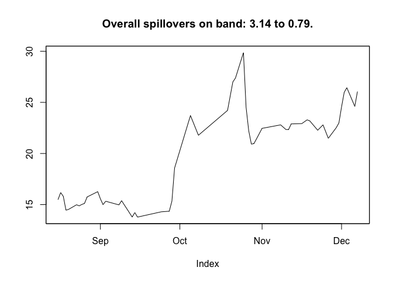
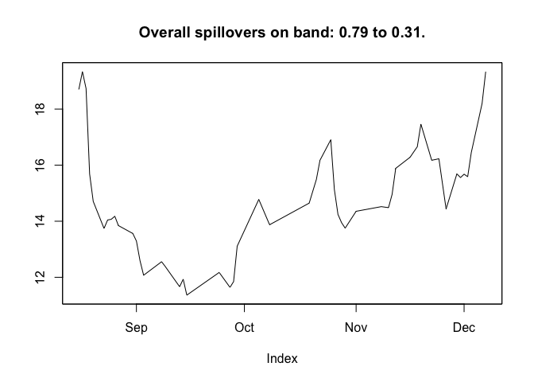
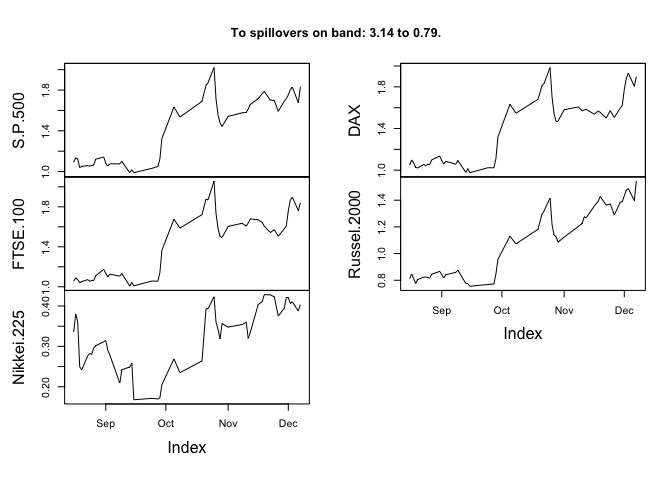
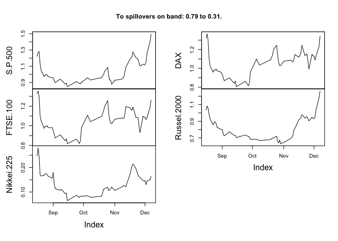
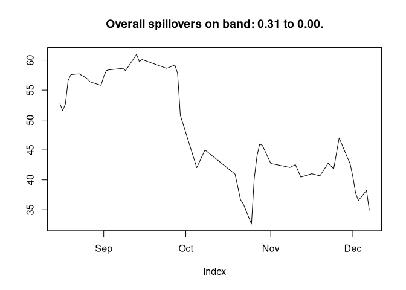
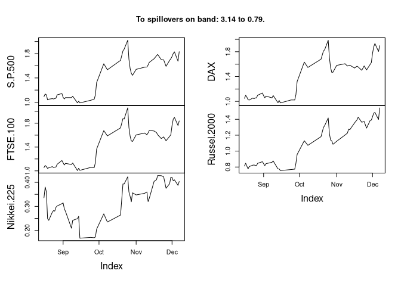

frequencyConnectedness
================

[](https://travis-ci.org/tomaskrehlik/frequencyConnectedness.svg?branch=master)

A package implementing frequency dependent connectedness due to
[Barunik, Krehlik
(2018)](https://academic.oup.com/jfec/article-abstract/16/2/271/4868603?redirectedFrom=fulltext "Barunik, J., Krehlik, T., Measuring the Frequency Dynamics of Financial Connectedness and Systemic Risk")
as well as the traditional definitions of [Diebold, Yilmaz (2009,
2012)](http://www.sciencedirect.com/science/article/pii/S016920701100032X "Diebold, F. X., Yilmaz, K., Better to give than to receive: Predictive directional measurement of volatility spillovers").
See the papers for detailed description.

## NOTICE

There is a new version of the interface coming with the version `0.2.0`.
If you implemented anything prior to this version, you can install the
older stable version using

``` r
# install.packages("devtools")
library(devtools)
install_github("tomaskrehlik/frequencyConnectedness", tag = "0.1.6") 
```

## Installation

The stable version can be installed from `CRAN` by the standard means of
using `install.packages("frequencyConnectedness")`. If there is any
other development version, you can install it using the following
instructions.

Be sure to have installed the `devtools` package that allows you to
install packages from Github directly. To install the version from
branch `dev` do

``` r
# install.packages("devtools")
library(devtools)
install_github("tomaskrehlik/frequencyConnectedness", tag = "dev") 
```

## Usage

Currently the package works in close cooperation with the `vars`,
`urca`, and `BigVAR` packages. In general, if you have any model that
can produce the forecast error variance decomposition, it can be
relatively easily made to work with this package. Let me know by filing
an issue, if that is the case and I will try to incorporate it.

For the time being the following is available:

-   Traditional estimation of VAR
-   Fitting of the VECM model
-   Using `BigVAR` to fit VAR models with various penalization schemes

For the illustration purposes we include some simulated data and
volatilities data from the [Ox-Man
institute](http://realized.oxford-man.ox.ac.uk/).

Let’s walk through some basics. First load packages and get some data.

``` r
library(frequencyConnectedness)
```

    ## Loading required package: vars

    ## Loading required package: MASS

    ## Loading required package: strucchange

    ## Loading required package: zoo

    ## 
    ## Attaching package: 'zoo'

    ## The following objects are masked from 'package:base':
    ## 
    ##     as.Date, as.Date.numeric

    ## Loading required package: sandwich

    ## Loading required package: urca

    ## Loading required package: lmtest

    ## Loading required package: knitr

    ## Loading required package: pbapply

    ## **********
    ## The syntax has changed since the version 0.1.6. check out the README at the github.com/tomaskrehlik/frequencyConnectedness .
    ## **********

    ## 
    ## Attaching package: 'frequencyConnectedness'

    ## The following object is masked from 'package:vars':
    ## 
    ##     fevd

``` r
data(exampleSim)
# Shorten the data, rolling estimation takes quite some time
exampleSim <- exampleSim[1:600,]
```

Then compute a system estimate on which the computation of connectedness
is based:

``` r
# Compute the VAR(2) estimate with constant and save results
est <- VAR(exampleSim, p = 2, type = "const")
# Alternatively, you could use VECM
# est <- vec2var(ca.jo(exampleSim, ecdet = "trend", K = 2), r = 1)
```

Then use the estimate to compute the connectedness measures. First, the
traditional overall measures that are not frequency dependent as in
Diebold and Yilmaz, also with the possibility of nullifying the cross
correlation elements. These commands print out the table and all the
relevant measures.

``` r
# Compute traditional spillovers
spilloverDY09(est, n.ahead = 100, no.corr = F)
```

    ## The spillover table has no frequency bands, standard Diebold & Yilmaz.
    ## 
    ## 
    ## |   |   V1|    V2|    V3|  FROM|
    ## |:--|----:|-----:|-----:|-----:|
    ## |V1 | 8.84|  7.13| 84.03| 30.39|
    ## |V2 | 2.65| 10.09| 87.26| 29.97|
    ## |V3 | 0.31|  0.20| 99.50|  0.17|
    ## |TO | 0.99|  2.44| 57.10| 60.53|

``` r
spilloverDY12(est, n.ahead = 100, no.corr = F)
```

    ## The spillover table has no frequency bands, standard Diebold & Yilmaz.
    ## 
    ## 
    ## |   |   V1|    V2|    V3|  FROM|
    ## |:--|----:|-----:|-----:|-----:|
    ## |V1 | 8.56| 10.34| 81.09| 30.48|
    ## |V2 | 2.62| 11.50| 85.88| 29.50|
    ## |V3 | 0.31|  0.26| 99.43|  0.19|
    ## |TO | 0.97|  3.53| 55.66| 60.17|

``` r
spilloverDY09(est, n.ahead = 100, no.corr = T)
```

    ## The spillover table has no frequency bands, standard Diebold & Yilmaz.
    ## 
    ## 
    ## |   |   V1|    V2|    V3|  FROM|
    ## |:--|----:|-----:|-----:|-----:|
    ## |V1 | 5.61|  8.15| 86.24| 31.46|
    ## |V2 | 1.10| 11.09| 87.81| 29.64|
    ## |V3 | 0.24|  0.22| 99.54|  0.15|
    ## |TO | 0.44|  2.79| 58.02| 61.25|

``` r
spilloverDY12(est, n.ahead = 100, no.corr = T)
```

    ## The spillover table has no frequency bands, standard Diebold & Yilmaz.
    ## 
    ## 
    ## |   |   V1|    V2|    V3|  FROM|
    ## |:--|----:|-----:|-----:|-----:|
    ## |V1 | 5.61|  8.15| 86.24| 31.46|
    ## |V2 | 1.10| 11.09| 87.81| 29.64|
    ## |V3 | 0.24|  0.22| 99.54|  0.15|
    ## |TO | 0.44|  2.79| 58.02| 61.25|

If you save them, you can use the functions
`overall, to, from, net, pairwise` to extract the spillovers in numeric
form

``` r
sp <- spilloverDY12(est, n.ahead = 100, no.corr = T)
overall(sp)
```

    ## [[1]]
    ## [1] 61.25391

``` r
to(sp)
```

    ## [[1]]
    ##         V1         V2         V3 
    ##  0.4445176  2.7906399 58.0187552

``` r
from(sp)
```

    ## [[1]]
    ##         V1         V2         V3 
    ## 31.4636556 29.6365456  0.1537115

``` r
net(sp)
```

    ## [[1]]
    ##        V1        V2        V3 
    ## -31.01914 -26.84591  57.86504

``` r
pairwise(sp)
```

    ## [[1]]
    ##     V1-V2     V1-V3     V2-V3 
    ##  2.350667 28.668472 29.196572

Next, we can decompose the measure on desired frequencies and get the
frequency dependent measures.

``` r
# Get the frequency connectedness on partition (pi,pi/4), (pi/4,0), roughly
# corresponding to movements of 1 to 4 days and 4 to longer.
bounds <- c(pi+0.00001, pi/4, 0)
spilloverBK09(est, n.ahead = 100, no.corr = F, partition = bounds)
```

    ## The spillover table has 2 frequency bands.
    ## 
    ## 
    ## The spillover table for band: 3.14 to 0.79
    ## Roughly corresponds to 1 days to 4 days.
    ## 
    ## 
    ## |       |   V1|   V2|    V3| FROM_ABS| FROM_WTH|
    ## |:------|----:|----:|-----:|--------:|--------:|
    ## |V1     | 0.15| 0.26|  0.55|     0.27|     2.11|
    ## |V2     | 0.09| 2.27|  4.85|     1.65|    12.97|
    ## |V3     | 0.04| 0.02| 29.87|     0.02|     0.17|
    ## |TO_ABS | 0.04| 0.09|  1.80|     1.94|         |
    ## |TO_WTH | 0.35| 0.73| 14.17|         |    15.25|
    ## 
    ## 
    ## The spillover table for band: 0.79 to 0.00
    ## Roughly corresponds to 4 days to Inf days.
    ## 
    ## 
    ## |       |   V1|   V2|    V3| FROM_ABS| FROM_WTH|
    ## |:------|----:|----:|-----:|--------:|--------:|
    ## |V1     | 8.69| 6.87| 83.49|    30.12|    34.50|
    ## |V2     | 2.56| 7.82| 82.41|    28.32|    32.44|
    ## |V3     | 0.27| 0.17| 69.62|     0.15|     0.17|
    ## |TO_ABS | 0.94| 2.35| 55.30|    58.59|         |
    ## |TO_WTH | 1.08| 2.69| 63.34|         |    67.11|

``` r
spilloverBK12(est, n.ahead = 100, no.corr = F, partition = bounds)
```

    ## The spillover table has 2 frequency bands.
    ## 
    ## 
    ## The spillover table for band: 3.14 to 0.79
    ## Roughly corresponds to 1 days to 4 days.
    ## 
    ## 
    ## |       |   V1|   V2|    V3| FROM_ABS| FROM_WTH|
    ## |:------|----:|----:|-----:|--------:|--------:|
    ## |V1     | 0.14| 0.28|  0.53|     0.27|     2.11|
    ## |V2     | 0.09| 2.30|  4.81|     1.63|    12.87|
    ## |V3     | 0.04| 0.04| 29.86|     0.03|     0.21|
    ## |TO_ABS | 0.04| 0.10|  1.78|     1.93|         |
    ## |TO_WTH | 0.35| 0.82| 14.02|         |    15.19|
    ## 
    ## 
    ## The spillover table for band: 0.79 to 0.00
    ## Roughly corresponds to 4 days to Inf days.
    ## 
    ## 
    ## |       |   V1|    V2|    V3| FROM_ABS| FROM_WTH|
    ## |:------|----:|-----:|-----:|--------:|--------:|
    ## |V1     | 8.42| 10.07| 80.57|    30.21|    34.60|
    ## |V2     | 2.52|  9.20| 81.07|    27.86|    31.92|
    ## |V3     | 0.27|  0.22| 69.57|     0.16|     0.19|
    ## |TO_ABS | 0.93|  3.43| 53.88|    58.24|         |
    ## |TO_WTH | 1.07|  3.93| 61.71|         |    66.71|

``` r
spilloverBK09(est, n.ahead = 100, no.corr = T, partition = bounds)
```

    ## The spillover table has 2 frequency bands.
    ## 
    ## 
    ## The spillover table for band: 3.14 to 0.79
    ## Roughly corresponds to 1 days to 4 days.
    ## 
    ## 
    ## |       |   V1|   V2|    V3| FROM_ABS| FROM_WTH|
    ## |:------|----:|----:|-----:|--------:|--------:|
    ## |V1     | 0.13| 0.28|  0.56|     0.28|     2.20|
    ## |V2     | 0.03| 2.39|  4.88|     1.64|    12.86|
    ## |V3     | 0.03| 0.02| 29.89|     0.02|     0.14|
    ## |TO_ABS | 0.02| 0.10|  1.81|     1.94|         |
    ## |TO_WTH | 0.17| 0.79| 14.24|         |    15.20|
    ## 
    ## 
    ## The spillover table for band: 0.79 to 0.00
    ## Roughly corresponds to 4 days to Inf days.
    ## 
    ## 
    ## |       |   V1|   V2|    V3| FROM_ABS| FROM_WTH|
    ## |:------|----:|----:|-----:|--------:|--------:|
    ## |V1     | 5.48| 7.87| 85.68|    31.18|    35.74|
    ## |V2     | 1.06| 8.70| 82.93|    28.00|    32.09|
    ## |V3     | 0.21| 0.20| 69.65|     0.14|     0.16|
    ## |TO_ABS | 0.42| 2.69| 56.20|    59.32|         |
    ## |TO_WTH | 0.49| 3.08| 64.41|         |    67.98|

``` r
spilloverBK12(est, n.ahead = 100, no.corr = T, partition = bounds)
```

    ## The spillover table has 2 frequency bands.
    ## 
    ## 
    ## The spillover table for band: 3.14 to 0.79
    ## Roughly corresponds to 1 days to 4 days.
    ## 
    ## 
    ## |       |   V1|   V2|    V3| FROM_ABS| FROM_WTH|
    ## |:------|----:|----:|-----:|--------:|--------:|
    ## |V1     | 0.13| 0.28|  0.56|     0.28|     2.20|
    ## |V2     | 0.03| 2.39|  4.88|     1.64|    12.86|
    ## |V3     | 0.03| 0.02| 29.89|     0.02|     0.14|
    ## |TO_ABS | 0.02| 0.10|  1.81|     1.94|         |
    ## |TO_WTH | 0.17| 0.79| 14.24|         |    15.20|
    ## 
    ## 
    ## The spillover table for band: 0.79 to 0.00
    ## Roughly corresponds to 4 days to Inf days.
    ## 
    ## 
    ## |       |   V1|   V2|    V3| FROM_ABS| FROM_WTH|
    ## |:------|----:|----:|-----:|--------:|--------:|
    ## |V1     | 5.48| 7.87| 85.68|    31.18|    35.74|
    ## |V2     | 1.06| 8.70| 82.93|    28.00|    32.09|
    ## |V3     | 0.21| 0.20| 69.65|     0.14|     0.16|
    ## |TO_ABS | 0.42| 2.69| 56.20|    59.32|         |
    ## |TO_WTH | 0.49| 3.08| 64.41|         |    67.98|

Note that the bounds should cover the range `(1.001, 0)*pi`, because the
overall variance of the system is computed over these frequencies. (So
if you wanted to remove the trend from computations, you could use
`(1.001, 0.01)*pi` and the computation will ignore the variance created
around the zero frequency.) Again, if you save the outputs from the
`spillover....` function, you can evaluate the
`overall, to, from, net, pairwise` to get the relevant tables.

Moreover, if you want to aggregate the behaviour of some of the bands,
you can do:

``` r
# Get the frequency connectedness on partition (pi,pi/4), (pi/4,0), roughly
# corresponding to movements of 1 to 4 days and 4 to longer.
bounds <- c(pi+0.00001, pi/4, pi/10, 0)

spilloverBK12(est, n.ahead = 100, no.corr = F, partition = bounds)
```

    ## The spillover table has 3 frequency bands.
    ## 
    ## 
    ## The spillover table for band: 3.14 to 0.79
    ## Roughly corresponds to 1 days to 4 days.
    ## 
    ## 
    ## |       |   V1|   V2|    V3| FROM_ABS| FROM_WTH|
    ## |:------|----:|----:|-----:|--------:|--------:|
    ## |V1     | 0.14| 0.28|  0.53|     0.27|     2.11|
    ## |V2     | 0.09| 2.30|  4.81|     1.63|    12.87|
    ## |V3     | 0.04| 0.04| 29.86|     0.03|     0.21|
    ## |TO_ABS | 0.04| 0.10|  1.78|     1.93|         |
    ## |TO_WTH | 0.35| 0.82| 14.02|         |    15.19|
    ## 
    ## 
    ## The spillover table for band: 0.79 to 0.31
    ## Roughly corresponds to 4 days to 10 days.
    ## 
    ## 
    ## |       |   V1|   V2|    V3| FROM_ABS| FROM_WTH|
    ## |:------|----:|----:|-----:|--------:|--------:|
    ## |V1     | 1.74| 3.00| 19.54|     7.51|    22.61|
    ## |V2     | 0.94| 4.25| 31.71|    10.88|    32.75|
    ## |V3     | 0.18| 0.10| 38.24|     0.09|     0.29|
    ## |TO_ABS | 0.38| 1.03| 17.08|    18.49|         |
    ## |TO_WTH | 1.13| 3.11| 51.40|         |    55.64|
    ## 
    ## 
    ## The spillover table for band: 0.31 to 0.00
    ## Roughly corresponds to 10 days to Inf days.
    ## 
    ## 
    ## |       |   V1|   V2|    V3| FROM_ABS| FROM_WTH|
    ## |:------|----:|----:|-----:|--------:|--------:|
    ## |V1     | 6.68| 7.07| 61.02|    22.70|    41.98|
    ## |V2     | 1.58| 4.95| 49.36|    16.98|    31.41|
    ## |V3     | 0.08| 0.12| 31.34|     0.07|     0.13|
    ## |TO_ABS | 0.55| 2.40| 36.79|    39.75|         |
    ## |TO_WTH | 1.03| 4.43| 68.05|         |    73.51|

``` r
collapseBounds(spilloverBK12(est, n.ahead = 100, no.corr = F, partition = bounds), 1:2)
```

    ## The spillover table has 2 frequency bands.
    ## 
    ## 
    ## The spillover table for band: 3.14 to 0.31
    ## Roughly corresponds to 1 days to 10 days.
    ## 
    ## 
    ## |       |   V1|   V2|    V3| FROM_ABS| FROM_WTH|
    ## |:------|----:|----:|-----:|--------:|--------:|
    ## |V1     | 1.88| 3.27| 20.07|     7.78|    16.94|
    ## |V2     | 1.04| 6.55| 36.52|    12.52|    27.25|
    ## |V3     | 0.22| 0.14| 68.10|     0.12|     0.26|
    ## |TO_ABS | 0.42| 1.14| 18.86|    20.42|         |
    ## |TO_WTH | 0.91| 2.48| 41.07|         |    44.46|
    ## 
    ## 
    ## The spillover table for band: 0.31 to 0.00
    ## Roughly corresponds to 10 days to Inf days.
    ## 
    ## 
    ## |       |   V1|   V2|    V3| FROM_ABS| FROM_WTH|
    ## |:------|----:|----:|-----:|--------:|--------:|
    ## |V1     | 6.68| 7.07| 61.02|    22.70|    41.98|
    ## |V2     | 1.58| 4.95| 49.36|    16.98|    31.41|
    ## |V3     | 0.08| 0.12| 31.34|     0.07|     0.13|
    ## |TO_ABS | 0.55| 2.40| 36.79|    39.75|         |
    ## |TO_WTH | 1.03| 4.43| 68.05|         |    73.51|

In many cases, one is interested in the dynamics of the connectedness.
This can be achieved within the package by the following commands.

``` r
# Get the rolling window estimates
params_est = list(p = 2, type = "const")
sp <- spilloverRollingDY09(exampleSim, n.ahead = 100, no.corr = F, "VAR", params_est = params_est, window = 100)
# alternatively for co-integration you could do
# coint_est <- function(data, r) {
#     return(vec2var(ca.jo(data, ecdet = "trend", K = 2), r = r))
# }
# params_est = list(r = 1)
# sp <- spilloverRollingDY09(exampleSim, n.ahead = 100, no.corr = F, "coint_est", params_est = params_est, window = 100)
```

In general, the `spilloverRolling....` function takes the following
arguments:

-   data, as `exampleSim`
-   the arguments for relevant spillover function, as
    `n.ahead, no.corr`, and alternatively `partition` in case of the
    `BK` variant.
-   window, what window you should roll
-   name of function used for estimates, in this case `"VAR"`, and list
    of parameters for this function called `params_est`

Using this, one can plot the resulting spillover measures.

``` r
plotOverall(sp)
```

<!-- -->

``` r
plotTo(sp)
```

<!-- -->

``` r
plotFrom(sp)
```

<!-- -->

``` r
plotNet(sp)
```

<!-- -->

``` r
plotPairwise(sp)
```

<!-- -->

It is generally not a good idea to print all the spillover tables as
they are not informative.

To make your own rolling estimate, let’s follow this example. First, we
start with construction of unconditional estimate and then use the same
function for the rolling estimate. We perform VAR-LASSO estimation on a
big system of log-volatilities of financial indices with automatic
selection of the LASSO penalty using cross-validation.

``` r
# Example of usage of BigVAR package on the volatilities data that are included
library(BigVAR)
```

    ## Loading required package: lattice

``` r
data(volatilities)

big_var_est <- function(data) {
    Model1 = constructModel(as.matrix(data), p = 4, struct = "Basic", gran = c(50, 50), VARX = list(), verbose = F)
    Model1Results = cv.BigVAR(Model1)
}

# Perform the estimation
oo <- big_var_est(log(volatilities[apply(volatilities>0, 1, all),]))

spilloverDY12(oo, n.ahead = 100, no.corr = F)
```

    ## The spillover table has no frequency bands, standard Diebold & Yilmaz.
    ## 
    ## 
    ## |                        | S.P.500| FTSE.100| Nikkei.225|   DAX| Russel.2000| All.Ordinaries|  DJIA| Nasdaq.100| CAC.40| Hang.Seng| KOSPI.Composite.Index| AEX.Index| Swiss.Market.Index| IBEX.35| S.P.CNX.Nifty| IPC.Mexico| Bovespa.Index| S.P.TSX.Composite.Index| Euro.STOXX.50| FT.Straits.Times.Index| FTSE.MIB|  FROM|
    ## |:-----------------------|-------:|--------:|----------:|-----:|-----------:|--------------:|-----:|----------:|------:|---------:|---------------------:|---------:|------------------:|-------:|-------------:|----------:|-------------:|-----------------------:|-------------:|----------------------:|--------:|-----:|
    ## |S.P.500                 |   12.82|     6.30|       0.27|  5.00|       10.02|           0.86| 11.72|      11.40|   5.05|      0.22|                  0.76|      5.50|               4.28|    4.04|          0.05|       3.09|          2.44|                    7.11|          5.09|                   0.15|     3.82|  4.15|
    ## |FTSE.100                |    7.06|    10.34|       0.22|  7.64|        5.66|           1.31|  6.74|       6.22|   7.98|      0.21|                  0.75|      8.65|               6.25|    6.45|          0.28|       2.30|          1.79|                    5.97|          7.98|                   0.12|     6.08|  4.27|
    ## |Nikkei.225              |    5.94|     3.09|      39.79|  3.18|        3.25|           3.22|  6.07|       4.91|   2.77|      2.34|                  1.90|      2.99|               3.33|    2.84|          0.30|       3.51|          1.90|                    3.00|          3.14|                   0.80|     1.73|  2.87|
    ## |DAX                     |    5.65|     8.42|       0.26| 11.20|        4.39|           0.92|  5.49|       5.01|   9.23|      0.33|                  0.64|      9.36|               6.30|    7.29|          0.15|       1.66|          1.75|                    4.89|          9.67|                   0.19|     7.19|  4.23|
    ## |Russel.2000             |   12.18|     5.63|       0.14|  4.40|       16.15|           0.57| 10.87|      12.44|   4.36|      0.14|                  0.63|      4.90|               3.90|    3.52|          0.08|       3.05|          2.22|                    7.00|          4.36|                   0.11|     3.36|  3.99|
    ## |All.Ordinaries          |    6.65|     5.95|       1.83|  5.40|        4.67|          19.83|  6.55|       5.71|   4.95|      1.75|                  1.22|      5.56|               4.95|    4.30|          0.21|       2.22|          1.79|                    7.16|          5.25|                   0.70|     3.35|  3.82|
    ## |DJIA                    |   12.37|     6.42|       0.35|  5.14|        9.28|           1.15| 12.54|      10.71|   5.15|      0.26|                  0.74|      5.62|               4.43|    4.14|          0.04|       3.07|          2.50|                    6.92|          5.20|                   0.21|     3.77|  4.16|
    ## |Nasdaq.100              |   12.58|     5.63|       0.20|  4.58|       11.40|           0.63| 11.24|      14.47|   4.58|      0.18|                  0.51|      5.10|               3.77|    3.61|          0.04|       3.16|          2.70|                    7.28|          4.59|                   0.19|     3.55|  4.07|
    ## |CAC.40                  |    5.78|     8.67|       0.20|  8.85|        4.33|           0.99|  5.56|       5.07|  10.09|      0.20|                  0.57|      9.73|               6.39|    7.75|          0.16|       1.71|          1.54|                    4.74|          9.71|                   0.12|     7.84|  4.28|
    ## |Hang.Seng               |    4.54|     3.32|       2.77|  3.81|        2.83|           4.07|  4.63|       3.68|   2.87|     40.38|                  2.65|      3.43|               2.93|    2.46|          0.61|       1.27|          1.68|                    4.74|          3.33|                   2.33|     1.68|  2.84|
    ## |KOSPI.Composite.Index   |    7.20|     5.30|       0.90|  4.53|        6.70|           1.27|  6.83|       6.32|   4.19|      1.19|                 26.74|      4.56|               4.49|    3.46|          0.68|       2.18|          1.04|                    4.60|          4.24|                   0.43|     3.14|  3.49|
    ## |AEX.Index               |    6.18|     8.73|       0.21|  8.56|        4.83|           1.22|  5.98|       5.56|   9.00|      0.31|                  0.60|     10.17|               6.32|    7.02|          0.18|       1.99|          1.81|                    5.60|          8.86|                   0.17|     6.70|  4.28|
    ## |Swiss.Market.Index      |    6.55|     8.44|       0.50|  7.57|        4.91|           1.75|  6.34|       5.72|   7.90|      0.31|                  0.84|      8.32|              11.87|    6.55|          0.29|       2.18|          1.55|                    4.62|          7.80|                   0.21|     5.77|  4.20|
    ## |IBEX.35                 |    5.04|     8.39|       0.29|  8.54|        4.02|           0.45|  4.88|       4.36|   9.61|      0.08|                  0.49|      9.23|               6.42|   12.04|          0.21|       1.75|          1.66|                    3.18|         10.11|                   0.04|     9.21|  4.19|
    ## |S.P.CNX.Nifty           |    2.35|     4.01|       0.46|  3.01|        2.93|           0.80|  2.08|       2.14|   2.62|      1.54|                  1.31|      2.91|               3.25|    2.40|         57.48|       2.17|          1.50|                    1.96|          2.76|                   0.49|     1.82|  2.02|
    ## |IPC.Mexico              |    7.96|     5.36|       1.34|  4.31|        6.08|           0.94|  7.60|       7.07|   4.28|      0.20|                  0.81|      4.90|               3.87|    3.77|          0.51|      23.20|          5.04|                    5.31|          4.12|                   0.27|     3.05|  3.66|
    ## |Bovespa.Index           |    7.19|     4.82|       1.00|  4.42|        4.68|           0.39|  6.97|       6.38|   4.34|      0.40|                  0.41|      4.55|               2.90|    3.83|          0.25|       4.97|         28.16|                    6.29|          4.58|                   0.20|     3.30|  3.42|
    ## |S.P.TSX.Composite.Index |    9.88|     5.91|       0.15|  4.86|        8.18|           1.47|  9.21|       9.20|   4.69|      0.27|                  0.54|      5.49|               3.45|    3.56|          0.09|       2.90|          3.08|                   18.41|          4.70|                   0.19|     3.76|  3.89|
    ## |Euro.STOXX.50           |    5.68|     8.59|       0.25|  9.14|        4.31|           0.99|  5.47|       4.96|   9.63|      0.22|                  0.56|      9.48|               6.28|    8.01|          0.16|       1.62|          1.54|                    4.66|         10.14|                   0.12|     8.18|  4.28|
    ## |FT.Straits.Times.Index  |    4.32|     3.71|       2.33|  4.51|        2.69|           3.71|  4.49|       3.92|   3.47|      3.66|                  1.23|      3.97|               3.25|    2.63|          0.51|       2.26|          1.77|                    4.56|          3.74|                  37.08|     2.20|  3.00|
    ## |FTSE.MIB                |    5.08|     8.33|       0.22|  8.50|        3.85|           0.32|  4.80|       4.58|   9.57|      0.05|                  0.42|      9.30|               5.97|    8.96|          0.15|       1.42|          1.52|                    3.93|          9.97|                   0.05|    13.01|  4.14|
    ## |TO                      |    6.67|     5.95|       0.66|  5.52|        5.19|           1.29|  6.36|       5.97|   5.54|      0.66|                  0.84|      5.88|               4.42|    4.60|          0.24|       2.31|          1.94|                    4.93|          5.68|                   0.34|     4.26| 79.24|

``` r
spilloverBK12(oo, n.ahead = 100, no.corr = F, partition = bounds)
```

    ## The spillover table has 3 frequency bands.
    ## 
    ## 
    ## The spillover table for band: 3.14 to 0.79
    ## Roughly corresponds to 1 days to 4 days.
    ## 
    ## 
    ## |                        | S.P.500| FTSE.100| Nikkei.225|  DAX| Russel.2000| All.Ordinaries| DJIA| Nasdaq.100| CAC.40| Hang.Seng| KOSPI.Composite.Index| AEX.Index| Swiss.Market.Index| IBEX.35| S.P.CNX.Nifty| IPC.Mexico| Bovespa.Index| S.P.TSX.Composite.Index| Euro.STOXX.50| FT.Straits.Times.Index| FTSE.MIB| FROM_ABS| FROM_WTH|
    ## |:-----------------------|-------:|--------:|----------:|----:|-----------:|--------------:|----:|----------:|------:|---------:|---------------------:|---------:|------------------:|-------:|-------------:|----------:|-------------:|-----------------------:|-------------:|----------------------:|--------:|--------:|--------:|
    ## |S.P.500                 |    3.01|     1.12|       0.06| 0.88|        2.05|           0.05| 2.75|       2.42|   0.90|      0.04|                  0.11|      0.95|               0.64|    0.72|          0.01|       0.69|          0.71|                    1.43|          0.92|                   0.02|     0.70|     0.82|     4.08|
    ## |FTSE.100                |    0.84|     2.46|       0.03| 1.60|        0.55|           0.07| 0.82|       0.68|   1.74|      0.01|                  0.09|      1.81|               1.32|    1.43|          0.06|       0.32|          0.31|                    0.49|          1.74|                   0.01|     1.34|     0.73|     3.62|
    ## |Nikkei.225              |    0.52|     0.25|      10.66| 0.29|        0.40|           0.54| 0.52|       0.46|   0.24|      0.55|                  0.31|      0.26|               0.31|    0.27|          0.06|       0.24|          0.16|                    0.36|          0.28|                   0.13|     0.17|     0.30|     1.50|
    ## |DAX                     |    0.75|     1.77|       0.06| 2.73|        0.48|           0.06| 0.75|       0.63|   2.14|      0.03|                  0.11|      2.09|               1.38|    1.70|          0.04|       0.26|          0.31|                    0.43|          2.26|                   0.03|     1.60|     0.80|     4.01|
    ## |Russel.2000             |    2.69|     0.98|       0.04| 0.75|        3.93|           0.07| 2.39|       2.73|   0.73|      0.03|                  0.06|      0.82|               0.59|    0.60|          0.01|       0.72|          0.70|                    1.47|          0.74|                   0.02|     0.56|     0.80|     3.97|
    ## |All.Ordinaries          |    0.30|     0.27|       0.34| 0.22|        0.24|           7.03| 0.29|       0.25|   0.20|      0.21|                  0.13|      0.23|               0.29|    0.21|          0.03|       0.11|          0.09|                    0.26|          0.22|                   0.12|     0.12|     0.20|     0.98|
    ## |DJIA                    |    2.85|     1.14|       0.08| 0.93|        1.89|           0.06| 3.18|       2.23|   0.93|      0.04|                  0.12|      0.99|               0.66|    0.76|          0.01|       0.69|          0.71|                    1.38|          0.95|                   0.04|     0.71|     0.82|     4.08|
    ## |Nasdaq.100              |    3.05|     1.16|       0.04| 0.95|        2.61|           0.06| 2.70|       3.78|   0.94|      0.03|                  0.09|      1.06|               0.68|    0.73|          0.01|       0.75|          0.78|                    1.69|          0.95|                   0.04|     0.75|     0.91|     4.54|
    ## |CAC.40                  |    0.68|     1.74|       0.04| 1.94|        0.41|           0.05| 0.68|       0.56|   2.51|      0.01|                  0.07|      2.14|               1.35|    1.78|          0.03|       0.24|          0.27|                    0.38|          2.27|                   0.01|     1.66|     0.78|     3.87|
    ## |Hang.Seng               |    0.24|     0.10|       0.86| 0.16|        0.17|           0.46| 0.24|       0.20|   0.09|     17.68|                  0.57|      0.12|               0.13|    0.09|          0.17|       0.06|          0.13|                    0.15|          0.13|                   0.79|     0.07|     0.23|     1.17|
    ## |KOSPI.Composite.Index   |    0.41|     0.37|       0.35| 0.38|        0.27|           0.20| 0.41|       0.29|   0.31|      0.39|                 10.73|      0.31|               0.39|    0.28|          0.10|       0.20|          0.13|                    0.22|          0.32|                   0.11|     0.23|     0.27|     1.35|
    ## |AEX.Index               |    0.65|     1.65|       0.04| 1.71|        0.42|           0.05| 0.65|       0.56|   1.95|      0.01|                  0.07|      2.23|               1.25|    1.50|          0.03|       0.26|          0.25|                    0.41|          1.87|                   0.02|     1.44|     0.70|     3.51|
    ## |Swiss.Market.Index      |    0.51|     1.38|       0.07| 1.31|        0.35|           0.11| 0.51|       0.42|   1.42|      0.02|                  0.11|      1.44|               2.63|    1.20|          0.06|       0.23|          0.19|                    0.27|          1.38|                   0.02|     1.04|     0.57|     2.85|
    ## |IBEX.35                 |    0.70|     1.78|       0.07| 1.91|        0.44|           0.09| 0.71|       0.56|   2.21|      0.02|                  0.09|      2.05|               1.43|    3.13|          0.05|       0.27|          0.30|                    0.37|          2.34|                   0.01|     2.00|     0.83|     4.13|
    ## |S.P.CNX.Nifty           |    0.44|     0.60|       0.11| 0.44|        0.45|           0.07| 0.40|       0.45|   0.42|      0.18|                  0.19|      0.44|               0.49|    0.41|         20.00|       0.31|          0.22|                    0.26|          0.44|                   0.09|     0.34|     0.32|     1.60|
    ## |IPC.Mexico              |    1.85|     1.14|       0.16| 0.79|        1.46|           0.10| 1.76|       1.59|   0.83|      0.00|                  0.18|      1.00|               0.78|    0.75|          0.11|       8.91|          1.20|                    1.18|          0.75|                   0.05|     0.58|     0.77|     3.86|
    ## |Bovespa.Index           |    1.59|     0.93|       0.05| 0.82|        1.23|           0.02| 1.52|       1.42|   0.80|      0.06|                  0.07|      0.84|               0.53|    0.69|          0.05|       1.02|          7.33|                    1.12|          0.84|                   0.03|     0.56|     0.68|     3.37|
    ## |S.P.TSX.Composite.Index |    1.96|     0.93|       0.04| 0.74|        1.52|           0.05| 1.82|       1.84|   0.73|      0.02|                  0.08|      0.87|               0.49|    0.54|          0.02|       0.61|          0.68|                    4.22|          0.72|                   0.03|     0.61|     0.68|     3.39|
    ## |Euro.STOXX.50           |    0.72|     1.75|       0.06| 2.07|        0.44|           0.06| 0.72|       0.59|   2.30|      0.02|                  0.08|      2.07|               1.33|    1.91|          0.04|       0.22|          0.30|                    0.40|          2.53|                   0.01|     1.77|     0.80|     4.00|
    ## |FT.Straits.Times.Index  |    0.22|     0.17|       0.23| 0.26|        0.17|           0.31| 0.27|       0.26|   0.18|      0.86|                  0.19|      0.21|               0.17|    0.15|          0.09|       0.18|          0.10|                    0.19|          0.19|                  24.31|     0.14|     0.22|     1.08|
    ## |FTSE.MIB                |    0.75|     1.85|       0.04| 2.00|        0.45|           0.03| 0.72|       0.62|   2.31|      0.00|                  0.08|      2.17|               1.37|    2.25|          0.04|       0.23|          0.26|                    0.45|          2.43|                   0.01|     3.45|     0.86|     4.29|
    ## |TO_ABS                  |    1.03|     1.00|       0.13| 0.96|        0.76|           0.12| 0.98|       0.89|   1.02|      0.12|                  0.13|      1.04|               0.74|    0.85|          0.05|       0.36|          0.37|                    0.61|          1.04|                   0.08|     0.78|    13.08|         |
    ## |TO_WTH                  |    5.15|     5.01|       0.66| 4.78|        3.80|           0.60| 4.90|       4.45|   5.07|      0.60|                  0.66|      5.20|               3.70|    4.26|          0.24|       1.80|          1.85|                    3.06|          5.16|                   0.38|     3.89|         |    65.23|
    ## 
    ## 
    ## The spillover table for band: 0.79 to 0.31
    ## Roughly corresponds to 4 days to 10 days.
    ## 
    ## 
    ## |                        | S.P.500| FTSE.100| Nikkei.225|  DAX| Russel.2000| All.Ordinaries| DJIA| Nasdaq.100| CAC.40| Hang.Seng| KOSPI.Composite.Index| AEX.Index| Swiss.Market.Index| IBEX.35| S.P.CNX.Nifty| IPC.Mexico| Bovespa.Index| S.P.TSX.Composite.Index| Euro.STOXX.50| FT.Straits.Times.Index| FTSE.MIB| FROM_ABS| FROM_WTH|
    ## |:-----------------------|-------:|--------:|----------:|----:|-----------:|--------------:|----:|----------:|------:|---------:|---------------------:|---------:|------------------:|-------:|-------------:|----------:|-------------:|-----------------------:|-------------:|----------------------:|--------:|--------:|--------:|
    ## |S.P.500                 |    2.24|     0.89|       0.06| 0.71|        1.66|           0.08| 2.03|       1.99|   0.72|      0.03|                  0.09|      0.77|               0.58|    0.58|          0.01|       0.53|          0.49|                    1.06|          0.73|                   0.02|     0.57|     0.65|     4.30|
    ## |FTSE.100                |    0.83|     1.39|       0.05| 0.98|        0.66|           0.10| 0.80|       0.73|   1.06|      0.01|                  0.08|      1.14|               0.80|    0.86|          0.04|       0.30|          0.27|                    0.57|          1.05|                   0.01|     0.81|     0.53|     3.52|
    ## |Nikkei.225              |    1.30|     0.63|       7.00| 0.66|        0.86|           0.49| 1.31|       1.10|   0.58|      0.45|                  0.35|      0.63|               0.64|    0.60|          0.06|       0.60|          0.38|                    0.76|          0.66|                   0.14|     0.41|     0.60|     3.98|
    ## |DAX                     |    0.81|     1.26|       0.07| 1.76|        0.64|           0.08| 0.79|       0.72|   1.43|      0.04|                  0.09|      1.43|               0.96|    1.16|          0.03|       0.26|          0.28|                    0.52|          1.51|                   0.03|     1.10|     0.63|     4.17|
    ## |Russel.2000             |    2.05|     0.78|       0.03| 0.61|        2.87|           0.05| 1.81|       2.13|   0.60|      0.02|                  0.06|      0.68|               0.51|    0.50|          0.01|       0.54|          0.46|                    1.09|          0.61|                   0.02|     0.47|     0.62|     4.12|
    ## |All.Ordinaries          |    0.77|     0.60|       0.35| 0.52|        0.59|           3.46| 0.76|       0.67|   0.48|      0.25|                  0.16|      0.55|               0.54|    0.46|          0.04|       0.26|          0.20|                    0.61|          0.52|                   0.11|     0.31|     0.42|     2.76|
    ## |DJIA                    |    2.16|     0.91|       0.07| 0.73|        1.53|           0.12| 2.21|       1.84|   0.74|      0.03|                  0.09|      0.79|               0.61|    0.61|          0.01|       0.52|          0.49|                    1.02|          0.76|                   0.03|     0.57|     0.65|     4.31|
    ## |Nasdaq.100              |    2.35|     0.90|       0.05| 0.74|        2.13|           0.07| 2.08|       2.84|   0.73|      0.03|                  0.07|      0.82|               0.57|    0.58|          0.01|       0.61|          0.58|                    1.28|          0.74|                   0.04|     0.57|     0.71|     4.72|
    ## |CAC.40                  |    0.77|     1.24|       0.06| 1.29|        0.55|           0.10| 0.75|       0.67|   1.55|      0.02|                  0.07|      1.47|               0.94|    1.19|          0.03|       0.25|          0.24|                    0.48|          1.47|                   0.01|     1.19|     0.61|     4.03|
    ## |Hang.Seng               |    0.56|     0.29|       0.51| 0.37|        0.39|           0.44| 0.58|       0.46|   0.26|      7.57|                  0.42|      0.32|               0.30|    0.25|          0.10|       0.13|          0.22|                    0.36|          0.33|                   0.41|     0.15|     0.33|     2.16|
    ## |KOSPI.Composite.Index   |    0.82|     0.56|       0.23| 0.52|        0.65|           0.13| 0.81|       0.68|   0.46|      0.22|                  5.09|      0.49|               0.49|    0.40|          0.09|       0.32|          0.26|                    0.45|          0.48|                   0.07|     0.35|     0.40|     2.68|
    ## |AEX.Index               |    0.78|     1.24|       0.05| 1.22|        0.61|           0.10| 0.76|       0.71|   1.36|      0.03|                  0.06|      1.56|               0.91|    1.06|          0.03|       0.28|          0.26|                    0.55|          1.32|                   0.02|     1.00|     0.59|     3.90|
    ## |Swiss.Market.Index      |    0.69|     1.08|       0.08| 0.99|        0.49|           0.15| 0.68|       0.58|   1.06|      0.03|                  0.09|      1.09|               1.78|    0.90|          0.05|       0.26|          0.22|                    0.39|          1.04|                   0.02|     0.78|     0.51|     3.36|
    ## |IBEX.35                 |    0.82|     1.42|       0.08| 1.46|        0.61|           0.09| 0.80|       0.69|   1.65|      0.02|                  0.08|      1.57|               1.10|    2.16|          0.04|       0.30|          0.30|                    0.46|          1.75|                   0.01|     1.55|     0.70|     4.67|
    ## |S.P.CNX.Nifty           |    0.54|     0.91|       0.10| 0.69|        0.62|           0.09| 0.47|       0.52|   0.66|      0.15|                  0.18|      0.70|               0.72|    0.63|          9.66|       0.47|          0.34|                    0.36|          0.69|                   0.07|     0.55|     0.45|     2.98|
    ## |IPC.Mexico              |    1.28|     0.80|       0.18| 0.61|        1.05|           0.10| 1.21|       1.17|   0.62|      0.01|                  0.12|      0.72|               0.56|    0.55|          0.08|       4.40|          0.74|                    0.78|          0.58|                   0.04|     0.44|     0.55|     3.68|
    ## |Bovespa.Index           |    1.33|     0.72|       0.07| 0.62|        1.11|           0.03| 1.25|       1.24|   0.60|      0.05|                  0.06|      0.65|               0.43|    0.51|          0.04|       0.75|          4.09|                    0.95|          0.63|                   0.03|     0.43|     0.55|     3.63|
    ## |S.P.TSX.Composite.Index |    1.24|     0.54|       0.03| 0.41|        1.06|           0.09| 1.14|       1.19|   0.41|      0.02|                  0.05|      0.49|               0.30|    0.31|          0.01|       0.38|          0.40|                    2.26|          0.41|                   0.02|     0.33|     0.42|     2.79|
    ## |Euro.STOXX.50           |    0.79|     1.28|       0.07| 1.39|        0.57|           0.11| 0.76|       0.67|   1.52|      0.02|                  0.07|      1.47|               0.96|    1.28|          0.03|       0.25|          0.25|                    0.49|          1.60|                   0.02|     1.30|     0.63|     4.20|
    ## |FT.Straits.Times.Index  |    0.48|     0.41|       0.39| 0.55|        0.32|           0.44| 0.50|       0.45|   0.40|      0.62|                  0.17|      0.46|               0.39|    0.32|          0.10|       0.30|          0.19|                    0.38|          0.45|                   6.83|     0.26|     0.36|     2.40|
    ## |FTSE.MIB                |    0.71|     1.27|       0.05| 1.33|        0.49|           0.05| 0.68|       0.63|   1.51|      0.01|                  0.07|      1.45|               0.94|    1.45|          0.03|       0.22|          0.24|                    0.46|          1.59|                   0.01|     2.13|     0.63|     4.17|
    ## |TO_ABS                  |    1.00|     0.84|       0.12| 0.78|        0.79|           0.14| 0.95|       0.90|   0.80|      0.10|                  0.12|      0.84|               0.63|    0.68|          0.04|       0.36|          0.32|                    0.62|          0.82|                   0.05|     0.63|    11.54|         |
    ## |TO_WTH                  |    6.65|     5.60|       0.82| 5.18|        5.24|           0.93| 6.31|       5.94|   5.32|      0.64|                  0.77|      5.58|               4.18|    4.48|          0.26|       2.38|          2.15|                    4.11|          5.46|                   0.35|     4.15|         |    76.51|
    ## 
    ## 
    ## The spillover table for band: 0.31 to 0.00
    ## Roughly corresponds to 10 days to Inf days.
    ## 
    ## 
    ## |                        | S.P.500| FTSE.100| Nikkei.225|  DAX| Russel.2000| All.Ordinaries| DJIA| Nasdaq.100| CAC.40| Hang.Seng| KOSPI.Composite.Index| AEX.Index| Swiss.Market.Index| IBEX.35| S.P.CNX.Nifty| IPC.Mexico| Bovespa.Index| S.P.TSX.Composite.Index| Euro.STOXX.50| FT.Straits.Times.Index| FTSE.MIB| FROM_ABS| FROM_WTH|
    ## |:-----------------------|-------:|--------:|----------:|----:|-----------:|--------------:|----:|----------:|------:|---------:|---------------------:|---------:|------------------:|-------:|-------------:|----------:|-------------:|-----------------------:|-------------:|----------------------:|--------:|--------:|--------:|
    ## |S.P.500                 |    7.56|     4.29|       0.15| 3.41|        6.31|           0.73| 6.94|       6.99|   3.44|      0.15|                  0.56|      3.77|               3.06|    2.73|          0.03|       1.86|          1.24|                    4.61|          3.45|                   0.11|     2.56|     2.68|     4.14|
    ## |FTSE.100                |    5.38|     6.49|       0.14| 5.06|        4.45|           1.13| 5.11|       4.82|   5.18|      0.19|                  0.59|      5.70|               4.13|    4.16|          0.18|       1.68|          1.21|                    4.92|          5.19|                   0.11|     3.92|     3.01|     4.64|
    ## |Nikkei.225              |    4.13|     2.21|      22.12| 2.24|        1.99|           2.19| 4.24|       3.35|   1.95|      1.34|                  1.23|      2.11|               2.39|    1.97|          0.17|       2.67|          1.37|                    1.89|          2.20|                   0.52|     1.15|     1.97|     3.03|
    ## |DAX                     |    4.09|     5.39|       0.12| 6.71|        3.26|           0.78| 3.95|       3.66|   5.66|      0.27|                  0.45|      5.84|               3.96|    4.43|          0.07|       1.15|          1.16|                    3.93|          5.90|                   0.13|     4.49|     2.80|     4.31|
    ## |Russel.2000             |    7.44|     3.86|       0.07| 3.04|        9.35|           0.45| 6.67|       7.58|   3.03|      0.10|                  0.50|      3.40|               2.80|    2.42|          0.06|       1.80|          1.06|                    4.43|          3.02|                   0.07|     2.32|     2.58|     3.97|
    ## |All.Ordinaries          |    5.58|     5.08|       1.14| 4.65|        3.84|           9.35| 5.50|       4.79|   4.27|      1.29|                  0.94|      4.79|               4.12|    3.63|          0.15|       1.84|          1.50|                    6.29|          4.50|                   0.48|     2.92|     3.20|     4.94|
    ## |DJIA                    |    7.36|     4.36|       0.20| 3.48|        5.86|           0.97| 7.15|       6.64|   3.48|      0.19|                  0.53|      3.83|               3.16|    2.78|          0.03|       1.86|          1.30|                    4.52|          3.50|                   0.13|     2.48|     2.70|     4.16|
    ## |Nasdaq.100              |    7.17|     3.57|       0.11| 2.90|        6.65|           0.50| 6.46|       7.85|   2.90|      0.11|                  0.35|      3.23|               2.51|    2.30|          0.02|       1.81|          1.33|                    4.31|          2.91|                   0.11|     2.23|     2.45|     3.78|
    ## |CAC.40                  |    4.33|     5.68|       0.10| 5.62|        3.37|           0.84| 4.14|       3.85|   6.03|      0.17|                  0.43|      6.12|               4.10|    4.78|          0.10|       1.22|          1.03|                    3.88|          5.96|                   0.10|     4.99|     2.90|     4.47|
    ## |Hang.Seng               |    3.74|     2.93|       1.41| 3.28|        2.27|           3.17| 3.81|       3.02|   2.53|     15.13|                  1.65|      2.99|               2.51|    2.11|          0.34|       1.08|          1.33|                    4.22|          2.87|                   1.14|     1.45|     2.28|     3.51|
    ## |KOSPI.Composite.Index   |    5.97|     4.37|       0.31| 3.63|        5.78|           0.94| 5.61|       5.36|   3.43|      0.58|                 10.92|      3.76|               3.60|    2.77|          0.49|       1.65|          0.65|                    3.93|          3.44|                   0.24|     2.56|     2.81|     4.34|
    ## |AEX.Index               |    4.75|     5.84|       0.13| 5.63|        3.79|           1.07| 4.57|       4.29|   5.69|      0.27|                  0.47|      6.38|               4.16|    4.46|          0.12|       1.46|          1.29|                    4.64|          5.67|                   0.14|     4.27|     2.99|     4.60|
    ## |Swiss.Market.Index      |    5.36|     5.99|       0.35| 5.27|        4.07|           1.50| 5.16|       4.72|   5.42|      0.26|                  0.64|      5.79|               7.46|    4.46|          0.18|       1.69|          1.15|                    3.96|          5.38|                   0.17|     3.94|     3.12|     4.81|
    ## |IBEX.35                 |    3.52|     5.19|       0.14| 5.16|        2.97|           0.28| 3.37|       3.11|   5.75|      0.05|                  0.32|      5.61|               3.90|    6.74|          0.12|       1.17|          1.06|                    2.35|          6.01|                   0.03|     5.66|     2.66|     4.10|
    ## |S.P.CNX.Nifty           |    1.37|     2.50|       0.25| 1.88|        1.87|           0.64| 1.21|       1.17|   1.54|      1.21|                  0.94|      1.76|               2.04|    1.36|         27.82|       1.40|          0.94|                    1.34|          1.63|                   0.32|     0.93|     1.25|     1.93|
    ## |IPC.Mexico              |    4.83|     3.43|       0.99| 2.91|        3.57|           0.75| 4.62|       4.31|   2.83|      0.18|                  0.52|      3.18|               2.53|    2.47|          0.31|       9.89|          3.10|                    3.35|          2.79|                   0.18|     2.03|     2.33|     3.59|
    ## |Bovespa.Index           |    4.27|     3.17|       0.87| 2.98|        2.34|           0.34| 4.20|       3.71|   2.93|      0.29|                  0.28|      3.06|               1.93|    2.63|          0.17|       3.20|         16.73|                    4.22|          3.10|                   0.15|     2.31|     2.20|     3.39|
    ## |S.P.TSX.Composite.Index |    6.68|     4.44|       0.08| 3.71|        5.60|           1.34| 6.25|       6.17|   3.56|      0.24|                  0.41|      4.13|               2.67|    2.70|          0.07|       1.92|          2.00|                   11.93|          3.58|                   0.14|     2.81|     2.79|     4.29|
    ## |Euro.STOXX.50           |    4.17|     5.55|       0.12| 5.68|        3.30|           0.82| 3.99|       3.69|   5.81|      0.18|                  0.41|      5.94|               4.00|    4.81|          0.09|       1.15|          1.00|                    3.77|          6.01|                   0.09|     5.11|     2.84|     4.38|
    ## |FT.Straits.Times.Index  |    3.62|     3.13|       1.72| 3.70|        2.20|           2.95| 3.72|       3.20|   2.88|      2.18|                  0.88|      3.29|               2.68|    2.16|          0.32|       1.78|          1.47|                    4.00|          3.10|                   5.95|     1.80|     2.42|     3.73|
    ## |FTSE.MIB                |    3.62|     5.20|       0.13| 5.17|        2.91|           0.25| 3.39|       3.33|   5.74|      0.04|                  0.27|      5.68|               3.66|    5.26|          0.09|       0.97|          1.02|                    3.01|          5.95|                   0.04|     7.43|     2.65|     4.09|
    ## |TO_ABS                  |    4.64|     4.10|       0.41| 3.78|        3.64|           1.03| 4.42|       4.18|   3.72|      0.44|                  0.59|      4.00|               3.04|    3.07|          0.15|       1.59|          1.25|                    3.69|          3.82|                   0.21|     2.85|    54.62|         |
    ## |TO_WTH                  |    7.15|     6.33|       0.63| 5.83|        5.61|           1.59| 6.82|       6.44|   5.73|      0.68|                  0.91|      6.17|               4.69|    4.73|          0.23|       2.45|          1.92|                    5.70|          5.89|                   0.32|     4.40|         |    84.21|

``` r
# Now use the same function to perform the rolling estimation.
# The original estimation call was:
# big_var_est(log(volatilities[apply(volatilities>0, 1, all),]))
# so our data are:
# log(volatilities[apply(volatilities>0, 1, all),]) (we only use 1:150) because it takes a lot of time to fit
# n.ahead, no.corr, and window are self explanatory.
# name of the function to use for estimation is the big_var_est.
sp <- spilloverRollingBK12(log(volatilities[apply(volatilities>0, 1, all),])[1:150, ], n.ahead = 100, no.corr = F, func_est = "big_var_est", params_est = list(), window = 100, partition = bounds)

plotOverall(sp)
```

<!-- -->

    ## Press [enter] to continue

<!-- -->

    ## Press [enter] to continue

<!-- -->

    ## Press [enter] to continue

``` r
# I only plot 5 of the To indicators as plotting all of them is not nice
plotTo(sp, which = 1:5)
```

<!-- -->

    ## Press [enter] to continue

<!-- -->

    ## Press [enter] to continue

<!-- -->

    ## Press [enter] to continue

``` r
# You can extract the to spillovers
head(to(sp)[[1]])
```

    ##             S.P.500 FTSE.100 Nikkei.225      DAX Russel.2000 All.Ordinaries
    ## 2010-08-16 1.092763 1.055821  0.3357365 1.048865   0.8119556      0.2617002
    ## 2010-08-17 1.135323 1.090829  0.3804638 1.098868   0.8474986      0.2532974
    ## 2010-08-18 1.122591 1.072139  0.3606848 1.068658   0.8109318      0.2469820
    ## 2010-08-19 1.038712 1.041142  0.2494090 1.026778   0.7760478      0.1356267
    ## 2010-08-20 1.050142 1.052535  0.2420220 1.021441   0.8057059      0.1245161
    ## 2010-08-23 1.059194 1.071312  0.2763299 1.054489   0.8230861      0.1409823
    ##                 DJIA Nasdaq.100   CAC.40 Hang.Seng KOSPI.Composite.Index
    ## 2010-08-16 1.0322864  1.0343983 1.122883 0.2629027             0.3122641
    ## 2010-08-17 1.0735412  1.0763131 1.159241 0.2834025             0.3547999
    ## 2010-08-18 1.0382402  1.0452693 1.133898 0.2768759             0.3385957
    ## 2010-08-19 0.9577858  0.9657407 1.093776 0.1972696             0.2072048
    ## 2010-08-20 0.9638364  0.9797083 1.089570 0.1949809             0.2181384
    ## 2010-08-23 0.9680007  0.9833448 1.124544 0.2242558             0.2156809
    ##            AEX.Index Swiss.Market.Index   IBEX.35 S.P.CNX.Nifty IPC.Mexico
    ## 2010-08-16  1.084450          0.8820121 0.9609464     0.2463911  0.4102140
    ## 2010-08-17  1.148032          0.9134297 0.9950417     0.2631656  0.4491519
    ## 2010-08-18  1.120623          0.8862515 0.9737129     0.2705158  0.4365367
    ## 2010-08-19  1.061776          0.8443027 0.9664458     0.2049200  0.3325756
    ## 2010-08-20  1.062596          0.8372458 0.9710688     0.2086514  0.3328417
    ## 2010-08-23  1.105592          0.8763716 1.0168787     0.2300477  0.3387792
    ##            Bovespa.Index S.P.TSX.Composite.Index Euro.STOXX.50
    ## 2010-08-16     0.5676718               0.7214576      1.110111
    ## 2010-08-17     0.5942241               0.7380942      1.137389
    ## 2010-08-18     0.5707639               0.7574343      1.111851
    ## 2010-08-19     0.5232775               0.6530516      1.081962
    ## 2010-08-20     0.5266295               0.6536114      1.085337
    ## 2010-08-23     0.5432030               0.6606442      1.120170
    ##            FT.Straits.Times.Index  FTSE.MIB
    ## 2010-08-16              0.1821294 0.9461597
    ## 2010-08-17              0.2002062 0.9862774
    ## 2010-08-18              0.1940184 0.9689388
    ## 2010-08-19              0.1274595 0.9677523
    ## 2010-08-20              0.1398898 0.9751054
    ## 2010-08-23              0.1396566 1.0105690

If you have more cores at your disposal as is usual in the computers
nowadays, it is beneficial to use them through `parallel` package
especially in case of rolling estimation. If you use two cores it
usually almost doubles the speed. For example

``` r
library(parallel)
library(frequencyConnectedness)

exampleSim <- exampleSim[1:600,]
params_est = list(p = 2, type = "const")

# Export the relevant variables to the cluster so that it can use them
cl <- makeCluster(16)
clusterExport(cl, c("params_est", "exampleSim"))

sp <- spilloverRollingDY09(exampleSim, n.ahead = 100, no.corr = F, "VAR", params_est = params_est, window = 100, cluster=cl)

stopCluster(cl)
```

## Replication of paper and tests

I will release later some codes that replicat papers that we wrote using
this package and the methodology.

If you would be interested in having your script included, write me an
e-mail, or create an issue.

Because the package might change in the future, there is a set of test
to always preserve the integrity of the original functions. You can read
what is tested in the [testfile](tests/testthat/test-basic.r). Also
provided that you have the `testthat` package installed, you can run the
tests yourself.

``` r
library(frequencyConnectedness)
library(testthat)
test_package("frequencyConnectedness")
```

## License

This package is free and open source software, licensed under GPL (\>=
2).
